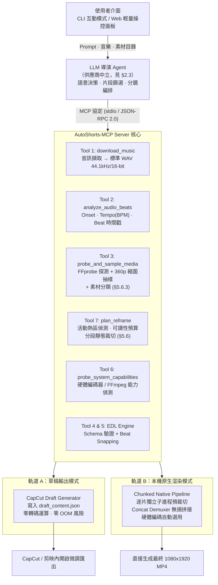

# AutoShorts-MCP：AI 驅動短影音自動化剪輯系統

## 軟體需求規格與專案開發計畫書 (Software Requirements Specification & Project Plan)

| 項目 | 內容 |
| :---- | :---- |
| **文件版本** | v1.4 |
| **專案版本** | v0.1 (Pre-Alpha / 規格定版) |
| **文件狀態** | Active（v1.0 已封存；v1.1 起改由 git 記錄沿革，見 §0.4） |
| **最後更新** | 2026-09-04 |
| **版本控制** | https://github.com/DreamOver9183/AutoShorts_MCP |
| **主要平台** | Windows 11 / Ubuntu LTS（本機執行，非容器化） |

---

## 0. 版本治理與文件修訂 (Version Governance)

### 0.1 兩套版本號的定義

本專案存在**兩套互相獨立**的版本號，容易混淆，於此明確定義：

| 版本號類型 | 目前值 | 定義 | 遞增時機 |
| :---- | :---- | :---- | :---- |
| **文件版本 (Document Version)** | **v1.4** | 本規格書自身的修訂版次。描述「我們打算做什麼」。 | 規格內容有實質變更時遞增（如新增工具、修改 Schema、調整架構）。 |
| **專案版本 (Project Version)** | **v0.1** | 實際交付軟體的版本。描述「我們已經做出什麼」。 | 依 §0.2 的版本階梯，隨里程碑完成而遞增。 |

> **關鍵約定**：規格書 v1.0 **不等於**專案 v1.0。規格書在專案尚未寫下第一行程式碼時即已是 v1.0；而專案版本要到「最小可行性產品 (MVP)」完成、通過 §8.4 全部驗收標準後，才正式標記為 `AutoShorts_MCP_v1.0`。

### 0.2 專案版本階梯 (Project Version Ladder)

| 專案版本 | 對應里程碑 | 完成定義 (Definition of Done) |
| :---- | :---- | :---- |
| **v0.1** | M0 — 規格定版 | 規格書 v1.1 定版、Repo 初始化、目錄結構與版控規範確立。**無可執行程式碼。** |
| **v0.2** | M1 — 影音核心模組 | 節拍分析、音訊下載、單片段 9:16 裁切三個模組可獨立以 CLI 執行並通過單元測試。 |
| **v0.3** | M2 — MCP 服務與 Agent | MCP Server 可被任一 MCP Client 連線，七個工具全部可呼叫，LLM 能產出通過 Schema 驗證的 EDL。 |
| **v0.4** | M3-A — 軌道 A 草稿輸出 | CapCut / 剪映草稿產生器可匯入並在目標軟體正確顯示時間軸。 |
| **v0.5** | M3-B — 軌道 B 原生渲染 | Chunked Pipeline 可端到端產出 1080x1920 MP4，硬體編碼器自動偵測生效。 |
| **v1.0** | M4 — MVP 驗收 | 通過 §8.4 全部驗收標準（含記憶體上限、音畫同步誤差、端到端成功率）。 |

v1.0 之後採用語意化版本 [Semantic Versioning 2.0.0](https://semver.org/lang/zh-TW/)。v1.0 之前的 `0.x` 版本**不保證**任何 API 或 EDL Schema 的向後相容性。

### 0.3 Git 分支與提交規範

**分支模型**：v1.0 前採簡化 Trunk-Based。

* `main` — 唯一長期分支，每個 `v0.x` 節點在此打上 tag。
* `feat/<模組名>` — 功能開發短分支，完成後 squash merge 回 `main`。

**提交訊息格式**：採 [Conventional Commits](https://www.conventionalcommits.org/)。

```
<type>(<scope>): <簡述>

<內文：說明「為什麼」而非「做了什麼」>
```

`type` 允許值：`feat` / `fix` / `docs` / `refactor` / `test` / `chore` / `perf` / `build`
`scope` 建議值：`audio` / `media` / `edl` / `mcp` / `capcut` / `render` / `llm` / `docs`

**版本標記 (Tag)**：每完成一個 §0.2 的版本階梯節點，在 `main` 打上 annotated tag：

```bash
git tag -a AutoShorts_MCP_v0.1 -m "M0: 規格書 v1.1 定版與 Repo 初始化"
```

### 0.4 文件修訂歷史

| 文件版本 | 日期 | 主要變更 |
| :---- | :---- | :---- |
| v1.0 | 2026-09-04 | 初版。已封存為歷史紀錄，不再維護。 |
| v1.1 | 2026-09-04 | 釐清版本治理、移除供應商綁定、補齊工程章節。已由 git 記錄，不再保留獨立檔案。 |
| v1.2 | 2026-09-04 | 素材預處理與內容感知重構。 |
| v1.3 | 2026-09-04 | 依單一真實素材實測修正分類器訊號排序。 |
| **v1.4** | **2026-09-04** | **跨 20 支獨立來源實測，修正 v1.3 的兩項過度宣稱**。見下方變更明細。 |

**v1.1 相對 v1.0 的變更明細**：

1. **【新增】** §0 版本治理章節，釐清文件版本與專案版本的分野。
2. **【修正】** 移除 LLM 供應商綁定。原文 §1.2 寫「Gemini 3.8 Flash」而 §3.2／§4／§7 寫「Gemini 2.5」，前後矛盾且「3.8 Flash」非現行官方型號名稱。改以 §2.3 的 **LLM Provider 抽象層**取代，具體型號移至設定檔。
3. **【修正】** 硬體編碼改為**完全供應商中立**。原文將 AMD AMF 設為預設值，但實測開發機為 NVIDIA + Intel 平台。改為啟動時自動偵測，依 `nvenc > qsv > amf > videotoolbox > libx264` 排序挑選（§3.2）。
4. **【修正】** 抽樣幀數上限前後不一致（§2.1 寫 12 張、§4.3 schema 寫 8 張）。統一為**預設 8 張、硬上限 12 張**。
5. **【修正】** 修正 §6 風險表中關於 FFmpeg `-ss` 參數位置的技術描述錯誤。原文宣稱「`-ss` 放在 `-i` 之前會導致切點飄移」，此說法在 FFmpeg 2.1 之後**僅在搭配 `-c copy` 時成立**；重新編碼時 `-ss` 前置是精確且高效的。詳見 §5.5。
6. **【修正】** 兩張以 base64 圖片內嵌的公式（原 §3.1 記憶體佔用率、原 §5.2 節拍吸附）無法閱讀，已改寫為文字化的完整演算法定義（§5.2、§5.4）。**語意為重建推定，需與原作者確認**（見附錄 A-6）。
7. **【新增】** §4.6 `probe_system_capabilities` 工具（核心工具由 5 個增為 6 個）。
8. **【新增】** §4.7 統一錯誤回傳規範。
9. **【新增】** §6 設定管理、§7 專案目錄結構、§8 測試策略與驗收標準、§11 授權與合規三個工程章節。
10. **【新增】** 風險表補上四項原先遺漏的高風險項目：CapCut 草稿格式逆向工程脆弱性、librosa 無原生 downbeat 偵測能力、音樂版權與服務條款合規、Concat Demuxer 參數不一致導致拼接失敗。
11. **【清理】** 移除 Google Docs 匯出殘留的跳脫字元（`\*`、`\_`、`\[ \]`、`\#`），程式碼與指令改用標準 fenced code block。

**v1.2 相對 v1.1 的變更明細**：

起因是一個實務觀察：大量素材來自**螢幕錄影**，而 v1.1 定義的三種 `reframe_mode` 對這類素材**全部失效**。經量化分析（§5.6.2），這不是美學問題而是幾何問題——現行的滿寬置入方式會讓 UI 文字縮到 9–19px，遠低於手機可讀門檻。

1. **【新增】** §5.6 素材預處理與內容感知重構，本次改版的核心。內含可讀性預算模型、素材分類器、活動熱區偵測與分段靜態裁切演算法。
2. **【新增】** §4.8 `plan_reframe` 工具（核心工具由 6 個增為 7 個）。
3. **【擴充】** §4.3 `probe_and_sample_media` 輸出加入素材分類結果與可讀性指標。
4. **【擴充】** §5.1 EDL 新增 `fit_height_crop`、`region_pan`、`auto` 三種重構模式與 `reframe_plan` 欄位；新增不變式 I-8。
5. **【新增】** §6 設定新增 `[reframe]` 區段；§3.3 新增 `opencv-python-headless` 相依（本機已具備）。
6. **【新增】** 風險 R-11（素材誤分類）、R-12（活動熱區誤導）、R-13（校準語料不足）。
7. **【新增】** 測試案例 T-11 ~ T-15；驗收標準 A-9（螢幕錄影可讀性）。
8. **【變更】** 文件版本管理方式：v1.1 起沿革改由 git 記錄，**不再產生平行的版本化檔案**。v1.0 暫予保留僅為支援附錄 A-6 的公式語意確認，該項結案後即可移除。

**v1.3 相對 v1.2 的變更明細**：

v1.2 的 §5.6.3 訊號排序是依**合成樣本**推定的。取得一份真實素材（4K／29.97fps／43.5 分鐘科技評論影片）後，以 120 個均勻取樣點、48 個人工目視標註重新驗證，**該排序被完全推翻**。

1. **【重大修正】** 軸向邊緣佔比從「最強訊號」降為輔助訊號。實測畫格層級 AUC 僅 **0.594**（0.5 = 無判別力）；以 v1.2 推定的 0.35 門檻分類，準確率 **0.49**，**低於「全判 natural」的基準線 0.70**——即該分類器比什麼都不做更糟。
2. **【重大修正】** 文字區塊密度從最末位升為**主訊號**。畫格層級 AUC 0.771，素材層級（k=8）達 **0.929**。
3. **【移除】** 時間靜止率。實測 AUC = **0.409**，低於 0.5，**方向與原假設相反**。
4. **【新增】** §5.6.3.2 素材層級聚合規範。畫格層級分類不可信，一律禁止；改為對 k 幀取中位數。k 直接沿用 §4.3 既有的 `sample_max_frames`（預設 8），無額外成本。
5. **【新增】** §5.6.3.3 執行順序規範。實測發現 letterbox 黑邊會使軸向邊緣佔比虛高至 0.73，故黑邊剝除**必須**在分類之前。
6. **【新增】** §5.6.3.4 完整實測數據，含三個 v1.2 未預見的干擾源：極簡背景產品攝影／3D 動畫、letterbox 黑邊、中文內容（中文筆畫方向多元，軸向訊號判別力更低）。
7. **【新增】** §5.6.3.7 降低對自動分類的依賴——自動分類降級為建議與預設值，CLI 須提供覆寫。
8. **【更新】** `[reframe]` 設定的門檻項目、風險 R-13、附錄 A-8、M1 校準工作項。

> **方法論註記**：本次實測語料為**單一來源**，不具跨來源變異，故「文字區塊密度門檻 = 4.9」仍為暫定值。但**負面結果的方向是保守的**——軸向邊緣佔比連這個相對容易的任務都做不好，對更難的任務更不能指望，故「降級」的結論可以採信。

**v1.4 相對 v1.3 的變更明細**：

v1.3 的結論來自**單一**真實素材。取得 20 支獨立來源的電影片段（1954–1999、含黑白片、11 支為 2.39:1 寬銀幕）後重新驗證，**v1.3 的兩項宣稱被推翻**。

1. **【修正過度宣稱】特異度**。v1.3 由單一來源自助抽樣估計門檻 4.9 的特異度為 0.95；跨 20 支獨立來源實測為 **0.80**（4/20 偽陽性）。**單一來源把偽陽性率低估了 4 倍**。門檻與特異度數字已全面更新（§5.6.3.4）。
2. **【修正過度宣稱】黑邊影響**。v1.3 §5.6.3.3 宣稱「letterbox 黑邊使 `axis_edge_ratio` 虛高至 0.73」。對 11 支含黑邊片段（黑邊面積中位 24.4%）做剝除前後對照，實測差值**平均 +0.017、最大 +0.058**。原宣稱屬**單一軼事樣本的錯誤因果歸因**——該樣本的高值實為極簡背景產品攝影所致。黑邊剝除仍應執行（它浪費可讀性預算，此論證獨立成立），但**不得宣稱它是分類訊號的重要汙染源**。
3. **【新增】偽陽性的真正失效模式**。原假設「字幕造成偽陽性」**遭否證**——偽陽性的文字狀元件集中在畫面**上方 75%**（上／下比最高達 15.6），非字幕帶。實際成因為 **MSER 將規則排列的小型高對比物件誤判為文字**：墓碑陣列、控制面板燈陣、百葉窗、桌上物件、臉部紋理。詳見 §5.6.3.5。
4. **【新增】§5.6.3.6 證據品質分級**，並訂立規範：**合成樣本不得作為規格中任何門檻或訊號排序的依據**。合成樣本已兩度產生誤導性結論（v1.2 的訊號排序、MSER 行為測試）。
5. **【更新】** 風險 R-13、附錄 A-8、`[reframe]` 門檻。

> **方法論教訓**：v1.2 → v1.3 → v1.4 三個版本，每次擴充語料都推翻上一版的結論。這說明**在語料達到足夠跨來源覆蓋前，任何門檻與訊號排序都應視為暫定**，且規格必須明確標示每項數字的證據強度（§5.6.3.6）。

---

## 1. 專案概述 (Project Overview)

### 1.1 背景與問題陳述

現代短影音（YouTube Shorts、Instagram Reels、TikTok）需求龐大，但傳統剪輯流程面臨以下門檻：

1. **學習成本高**：非專業使用者缺乏剪輯軟體（如 Premiere Pro、DaVinci Resolve）的時間軸操作、轉場設定與關鍵影格概念。
2. **耗時繁瑣**：素材挑選、音樂節拍對點（卡點）、畫面直式自適應（16:9 轉 9:16）等重複性工序耗費大量精力。
3. **運算資源瓶頸**：自動化剪輯若採用容器化封裝或單次巨型 Filtergraph 渲染，極易引發記憶體溢位（Out-Of-Memory, OOM），且無法直接善用主機端顯示卡之硬體編碼加速。

### 1.2 專案目標

打造一套基於 **Model Context Protocol (MCP)** 標準的影音剪輯系統，由大型語言模型扮演「導演與剪輯師」，藉由結構化工具呼叫（Tool Use）驅動底層影音處理管線。

**本系統不綁定任何特定 LLM 供應商或型號**。系統定義的是 LLM 必須具備的**能力集合**（見 §2.3），任何滿足該能力集合的模型皆可透過 Provider 轉接層接入。

使用者僅需提供：

* 素材資料夾（影片檔、相片檔）
* 剪輯風格描述（Prompt）
* 音樂來源（本機音訊或線上影音網址）

系統自動完成視聽分析、卡點編排，並輸出高品質 1080x1920 (9:16) 短影音或剪輯軟體草稿工程檔。

### 1.3 專案範疇 (Scope)

**包含範疇 (In-Scope)**

* 音訊自動下載、轉碼與節拍點偵測（BPM、Beat Timestamps、Downbeats）。
* 媒體素材規格探測（FFprobe）與輕量化低解析度抽樣（防止 OOM）。
* **素材預處理與內容感知重構**：素材類型分類（自然影片／螢幕錄影／簡報）、活動熱區偵測、可讀性預算評估，以及依熱區推導的分段靜態裁切（§5.6）。
* LLM 語意分析生成標準剪輯決定表（Edit Decision List, EDL）。
* **雙軌輸出架構**：
  * **軌道 A（極速草稿）**：輸出 CapCut / 剪映本機工程檔（`draft_content.json`），提供無損即時微調。
  * **軌道 B（原生直出）**：分段處理（Chunked Pipeline）結合本機 GPU 硬體編碼，直接產出最終 MP4。

**排除範疇 (Out-of-Scope)**

* 雲端多租戶 SaaS 平台維運。
* 複雜的 3D 特效合成與深度神經網路面部重構。
* 語音辨識（ASR）自動字幕生成 — 列為 v1.x 後續候選（見附錄 A-4）。
* **重構模式 `stacked_context`（上下雙窗格佈局）與 `auto_track`（逐幀平移追蹤）** — 經 §5.6.5 評估後排除於 v1.0，列為 v1.x 候選（見附錄 A-9）。
* 素材的版權清算與授權管理 — 由使用者自行負責（見 §11.3）。

### 1.4 名詞定義 (Glossary)

| 術語 | 定義 |
| :---- | :---- |
| **EDL** | Edit Decision List，剪輯決定表。本系統中指 §5.1 定義的 JSON 結構，是 LLM 唯一的結構化輸出格式，亦是兩條輸出軌道的共同輸入。 |
| **Beat / Downbeat** | Beat 為節拍點；Downbeat 為小節的第一拍（重拍），通常用於大段落切換。 |
| **Chunk** | 渲染管線中的最小獨立處理單元，對應 EDL timeline 中的一個 clip，由獨立子進程處理。 |
| **Reframe** | 將非 9:16 素材適配至 1080x1920 畫布的策略（模糊填充／中央裁切／Ken Burns 縮放）。 |
| **Snapping** | 節拍吸附。將 LLM 估算的鏡頭長度校正至最接近的節拍點，確保切點對齊音樂。 |
| **活動熱區 (Activity Heatmap)** | 由相鄰畫格差分累積而得的空間分布圖，用於推定螢幕錄影中「使用者正在操作的區域」。見 §5.6.4。 |
| **可讀性預算 (Legibility Budget)** | 描述「原始文字高度」經重構後於 1080x1920 輸出中所剩字高的量化模型。見 §5.6.2。 |
| **分段靜態裁切 (Piecewise-Static Crop)** | v1.0 採用的內容感知重構方案：將素材依活動熱區切成數段，每段用固定裁切矩形，段落邊界對齊節拍。見 §5.6.5。 |
| **MVP** | Minimum Viable Product，最小可行性產品。本專案定義見 §8.4。 |

---

## 2. 系統架構與設計模式 (System Architecture & Patterns)

本系統採 **MCP 代理人模式 (MCP Agent Architecture)** 搭配 **分離式雙軌渲染管線**。

### 2.1 架構總覽



### 2.2 記憶體防爆機制 (OOM Prevention Paradigm)

為徹底消除 Docker 或巨型 FFmpeg 命令引發的記憶體暴增，架構實施三層隔離：

1. **抽樣降規隔離**：視訊分析階段不抽取高解析度原幀。透過 FFmpeg 的 `scale=360:-2` 限制單張縮圖尺寸於數十 KB 內，單一素材抽樣**預設 8 張、硬上限 12 張**（v1.0 修正前後不一致之處）。
2. **處理時間分段 (Chunking)**：渲染引擎**禁止**將多路 1080p/4K 視訊同時掛載至單一記憶體圖形中。每個片段單獨啟動子進程執行裁切與 9:16 自適應，寫入硬碟暫存後由 OS 完整回收該進程記憶體。
3. **無損拼接 (Concat Demuxing)**：所有子片段標準化（1080x1920, 30fps, 統一編碼與像素格式）後，使用 FFmpeg 的 `-f concat` 串接清單，僅進行封裝層（Demuxer）拷貝，記憶體消耗恆定。

量化模型與實測門檻見 §5.4。

### 2.3 LLM Provider 抽象層 (Provider Abstraction)

> **設計原則**：規格書定義**能力需求**，設定檔決定**具體型號**。任何模型型號都不應出現在本文件的規範性條文中。

**2.3.1 必要能力集合**

實作 Provider 轉接層時，目標模型必須滿足下列全部能力：

| 能力 | 需求說明 | 用途 |
| :---- | :---- | :---- |
| **Vision（多圖輸入）** | 單次請求可接收 ≥ 60 張 360p 影像 | 讀取 §4.3 產出的素材縮圖，判斷畫面內容與可用性 |
| **結構化輸出** | 支援 JSON Schema 約束解碼，或至少能穩定產出合法 JSON | 產出符合 §5.1 EDL Schema 的輸出 |
| **長上下文** | ≥ 128K tokens | 同時容納素材清單、節拍網格與 System Prompt |
| **Tool / Function Calling** | 支援 MCP 標準工具呼叫 | 驅動 §4 的七個工具 |

**2.3.2 轉接層介面**

```
LLMProvider (抽象基底)
├── capabilities() -> ProviderCapabilities
├── generate_edl(system_prompt, media_manifest, beat_grid, user_prompt) -> EditDecisionList
└── close()
```

具體實作以外掛（extras）方式提供，安裝時按需選裝，核心套件不強制相依任何供應商 SDK：

```toml
[project.optional-dependencies]
gemini = ["google-genai>=1.0.0"]
claude  = ["anthropic>=0.40.0"]
openai  = ["openai>=1.50.0"]
local   = ["openai>=1.50.0"]   # 相容 OpenAI API 的本地推論端點（Ollama / vLLM / LM Studio）
```

**2.3.3 降級策略：Schema 修復迴圈**

若所選 Provider 不支援原生約束解碼，轉接層必須實作修復迴圈：

1. 以 Pydantic 驗證模型輸出。
2. 驗證失敗時，將**驗證錯誤訊息本身**回饋給模型要求修正。
3. 最多重試 **3 次**；仍失敗則回傳結構化錯誤（§4.7），不得回傳半成品 EDL。

---

## 3. 執行環境與硬體加速規格 (Environment & Hardware Specs)

系統預設運行於本機作業系統（推薦 Windows 11 或 Ubuntu LTS），以完整調用原生驅動程式與硬體解碼／編碼單元。**不採用容器化封裝**——容器內存取 GPU 編碼單元需額外的驅動穿透設定，且與 §2.2 的記憶體隔離策略衝突。

### 3.1 建議硬體基準

| 硬體組件 | 建議規格基準 | 系統運用與最佳化策略 |
| :---- | :---- | :---- |
| **中央處理器 (CPU)** | 6 核心 / 12 執行緒以上 | 負責多執行緒音訊頻譜分析 (librosa) 與 JSON 資料組裝。 |
| **系統記憶體 (RAM)** | 16 GB DDR4/DDR5 以上 | 提供分段預處理暫存。Chunked 架構下**全系統峰值 RAM 佔用須 ≤ 3 GB**（量化推導見 §5.4）。 |
| **顯示卡 (GPU)** | 任一支援硬體編碼之獨顯或內顯 | 啟用原生硬體加速，編碼器由系統自動偵測（見 §3.2）。**無獨顯亦可運行**，自動降級至 CPU 軟體編碼。 |
| **顯示記憶體 (VRAM)** | 4 GB 以上 | 4K 素材硬體解碼時的畫格緩衝。VRAM < 4 GB 時應停用硬體解碼、僅保留硬體編碼（見 §3.2.3）。 |
| **儲存裝置 (SSD)** | PCIe NVMe SSD，可用空間 ≥ 20 GB | 提供大量中間切片之高頻率讀寫，避免 I/O 等待造成管線延遲。 |

### 3.2 硬體編碼器自動偵測與降級鏈（供應商中立）

**3.2.1 設計決策**

v1.0 將 `hw_accel` 預設值硬編為 `"amf"`（AMD 專用），此設計在非 AMD 平台上會直接導致渲染失敗。v1.1 起：

> **規範**：`hw_accel` 參數**預設值為 `"auto"`**。系統啟動時實際探測本機可用編碼器並快取結果，使用者僅在需要覆寫時才顯式指定。

**3.2.2 偵測與優先序**

探測方式：執行 `ffmpeg -hide_banner -encoders`，並對每個候選編碼器以 `lavfi` 合成源進行 **1 秒實際編碼冒煙測試**（僅列於 `-encoders` 不代表驅動可用）。

```bash
# 冒煙測試範本（以候選編碼器 $ENC 代入）
ffmpeg -hide_banner -loglevel error -f lavfi -i testsrc2=size=1080x1920:rate=30 \
       -t 1 -c:v "$ENC" -f null -
```

通過測試者依下列優先序挑選：

| 優先序 | 編碼器 | 平台 | 備註 |
| :---- | :---- | :---- | :---- |
| 1 | `h264_nvenc` | NVIDIA | 品質與速度平衡最佳 |
| 2 | `h264_qsv` | Intel（含內顯） | 筆電平台常見的可靠備援 |
| 3 | `h264_amf` | AMD | |
| 4 | `h264_videotoolbox` | macOS | 供 macOS 開發環境使用 |
| 5 | `h264_vaapi` | Linux 泛用 | |
| 6 | `libx264` | 全平台（CPU） | **保底路徑，必定可用**。品質最佳但速度最慢。 |

**3.2.3 硬體解碼的獨立開關**

硬體**解碼**（`-hwaccel`）與硬體**編碼**（`-c:v`）必須是兩個獨立開關。原因：

* 4K 素材硬體解碼會佔用大量 VRAM，在 4 GB 級顯卡上與編碼器爭搶資源，反而觸發驅動層失敗。
* 部分驅動對非標準色彩空間的硬體解碼支援不完整，容易產生色偏。

**規範**：v1.0 預設 `hwaccel_decode = false`（CPU 解碼），僅硬體編碼。此設定在 §8.4 驗收通過後才評估是否開放。

**3.2.4 品質參數對照**

各家硬體編碼器的品質參數語意不同，不可共用同一組數值。Provider 層必須維護對照表：

| 編碼器 | 品質參數 | 建議值（短影音） |
| :---- | :---- | :---- |
| `libx264` | `-crf` | `18` (`-preset medium`) |
| `h264_nvenc` | `-cq` | `23` (`-preset p5 -rc vbr`) |
| `h264_qsv` | `-global_quality` | `23` (`-preset medium`) |
| `h264_amf` | `-qp_i/-qp_p` | `22` (`-quality balanced`) |

### 3.3 軟體依賴規格

* **Runtime**: Python 3.11 – 3.12
  * **上限說明**：librosa 相依 numba，而 numba 對新版 Python 的支援通常落後數個月。採用新 Python 版本前必須先確認 numba 相容性。
* **FFmpeg / FFprobe**: 6.1+ 或 7.x，需為含硬體編碼器的完整建置（Windows 建議 gyan.dev 或 BtbN 的 `full` build）。
  * FFmpeg 以**外部執行檔**形式透過 `subprocess` 呼叫，不以函式庫連結（授權考量見 §11.2）。

**Python 核心套件依賴（版本為下限，實際以 `pyproject.toml` 為準）**

| 套件 | 版本下限 | 用途 |
| :---- | :---- | :---- |
| `mcp` | `>=1.2.0` | 標準 Model Context Protocol 通訊協定 |
| `librosa` | `>=0.10.2` | 音訊訊號處理與節拍萃取 |
| `yt-dlp` | `>=2024.08.06` | 影音串流擷取（此套件更新極頻繁，建議不鎖上限） |
| `pydantic` | `>=2.7.0` | 資料模型與 Schema 驗證 |
| `opencv-python-headless` | `>=4.10.0` | §5.6 素材分類、活動熱區偵測與文字區塊估計。選 headless 版避免拉入 GUI 相依 |
| `numpy` | `>=1.26.0` | 熱區差分運算（亦為 librosa / opencv 的傳遞相依，此處顯式宣告） |
| `psutil` | `>=5.9.0` | 渲染期記憶體監控與 §8.4 驗收量測 |
| `typer` | `>=0.12.0` | CLI 介面 |

LLM 供應商 SDK 一律列為 optional extras，見 §2.3.2。

### 3.4 開發機實測基準線 (Reference Development Machine)

以下為 2026-09-04 於主要開發機實測所得，作為效能基準的參照點，**非最低需求**：

| 項目 | 實測值 | 對照 §3.1 基準 |
| :---- | :---- | :---- |
| CPU | Intel Core i5-11400H (6C / 12T) | ✅ 符合 |
| RAM | 23.8 GB | ✅ 高於基準 |
| GPU（獨立） | NVIDIA GeForce RTX 3050 Laptop, 4 GB VRAM | ✅ 支援 NVENC |
| GPU（內建） | Intel UHD Graphics | ✅ 支援 QSV，可作備援 |
| Python | 3.12.10 | ✅ 在支援區間內 |
| FFmpeg / FFprobe | **尚未安裝** | ⚠️ **M1 前置阻擋項** |
| yt-dlp | 尚未安裝 | 由 pip 相依安裝，非阻擋項 |
| opencv-python-headless | 5.0.0.93 | ✅ 已具備，§5.6 前處理無須額外重量級相依 |
| numpy | 2.3.5 | ✅ 已具備 |

> **行動項**：FFmpeg 缺席是 M1 的硬性前置條件。M1 的第一項工作即為建立環境檢查腳本並完成 FFmpeg 安裝與能力驗證（見 §10 M1）。
>
> **偵測結果推論**：此機台預期選中 `h264_nvenc`（優先序 1）。因 VRAM 僅 4 GB，§3.2.3 的「預設停用硬體解碼」規範在此機台上尤其重要。

---

## 4. MCP 工具介面規格 (MCP Tool Specifications)

MCP Server 需實作並向 LLM Client 暴露下列 **7 個**原子化核心工具。

### 4.1 `download_music`

* **功能描述**：解析線上影音 URL 或驗證本機音訊路徑，轉碼為標準未壓縮 WAV 檔（44.1 kHz, 16-bit, 立體聲）。
* **輸入參數 (Input Schema)**：

```json
{
  "type": "object",
  "properties": {
    "source": {
      "type": "string",
      "description": "線上影音網址，或本機音訊檔案絕對路徑"
    },
    "output_name": {
      "type": "string",
      "description": "儲存檔名 (不含副檔名)"
    }
  },
  "required": ["source", "output_name"]
}
```

* **輸出結果**：

```json
{
  "file_path": "D:/.../workspace/audio/bgm.wav",
  "duration": 187.42,
  "sample_rate": 44100,
  "source_type": "url"
}
```

* **合規要求**：本工具在處理 URL 前，必須向使用者顯示一次性的版權與服務條款提醒（見 §11.3）。

### 4.2 `analyze_audio_beats`

* **功能描述**：使用 librosa 分析音訊 Onset Strength Envelope，計算整體節奏（BPM）與所有重音／節拍點。
* **輸入參數 (Input Schema)**：

```json
{
  "type": "object",
  "properties": {
    "audio_path": {
      "type": "string",
      "description": "目標音訊 WAV 檔案絕對路徑"
    },
    "max_duration": {
      "type": "number",
      "default": 60.0,
      "description": "分析長度上限，單位秒（短影音預設 60 秒）"
    },
    "downbeat_strategy": {
      "type": "string",
      "enum": ["infer_4_4", "none"],
      "default": "infer_4_4",
      "description": "重拍推定策略。見下方說明。"
    }
  },
  "required": ["audio_path"]
}
```

* **輸出結果**：

```json
{
  "bpm": 128.0,
  "total_beats": 120,
  "beat_timestamps": [0.46, 0.93, 1.40, 1.87, 2.34, 2.81],
  "downbeats": [0.46, 2.34, 4.22],
  "downbeat_confidence": "inferred",
  "analyzed_duration": 60.0
}
```

* **⚠️ 重要技術限制（v1.1 新增）**：**librosa 本身不具備 downbeat（小節重拍）偵測能力**，其 `beat_track` 僅輸出等權重的 beat 序列。v1.0 規格直接列出 `downbeats` 欄位而未說明來源，是一個實作缺口。

  v1.0 的處理方式：採 `infer_4_4` 策略——**假設 4/4 拍**，取 beat 序列中每第 4 個點作為 downbeat，並在輸出中以 `downbeat_confidence: "inferred"` 明確標示此為推定值而非偵測值。

  真正的 downbeat 偵測需引入 `madmom` 等額外相依（該套件安裝相容性較差，且授權為 BSD + 學術使用限制條款），列為 v1.x 候選（附錄 A-3）。

### 4.3 `probe_and_sample_media`

* **功能描述**：探測目錄內所有影片與照片之技術屬性，並強制降解析度抽樣關鍵幀（縮圖）。
* **輸入參數 (Input Schema)**：

```json
{
  "type": "object",
  "properties": {
    "input_directory": {
      "type": "string",
      "description": "放置使用者素材的資料夾路徑"
    },
    "sample_max_frames": {
      "type": "integer",
      "default": 8,
      "minimum": 1,
      "maximum": 12,
      "description": "單支影片均勻抽樣幀數。硬上限 12 張，超出將被夾制。"
    }
  },
  "required": ["input_directory"]
}
```

* **輸出結果**：每個檔案的時長、原生寬高比、FPS、編碼格式，以及抽取後的 360p JPEG 縮圖路徑清單。

```json
{
  "media_count": 10,
  "items": [
    {
      "file_path": "D:/.../inputs/DJI_0042.MP4",
      "source_type": "video",
      "duration": 34.21,
      "width": 3840,
      "height": 2160,
      "aspect_ratio": "16:9",
      "fps": 29.97,
      "codec": "hevc",
      "rotation": 0,
      "thumbnails": [
        "D:/.../workspace/thumbs/DJI_0042_00.jpg",
        "D:/.../workspace/thumbs/DJI_0042_01.jpg"
      ],
      "content_analysis": {
        "content_class": "natural",
        "confidence": 0.91,
        "signals": {
          "text_block_density": 2.1,
          "color_sparsity": 0.21,
          "axis_edge_ratio": 0.18
        },
        "aggregated_over_frames": 8,
        "text_height_fraction": null,
        "static_border": null,
        "reframe_recommendation": "center_crop"
      }
    },
    {
      "file_path": "D:/.../inputs/screen_rec_01.mp4",
      "source_type": "video",
      "duration": 128.5,
      "width": 1920,
      "height": 1080,
      "aspect_ratio": "16:9",
      "fps": 30.0,
      "codec": "h264",
      "rotation": 0,
      "thumbnails": ["..."],
      "content_analysis": {
        "content_class": "screen_recording",
        "confidence": 0.88,
        "signals": {
          "text_block_density": 15.6,
          "color_sparsity": 0.74,
          "axis_edge_ratio": 0.52
        },
        "aggregated_over_frames": 8,
        "text_height_fraction": 0.0176,
        "static_border": { "x": 0, "y": 0, "w": 1920, "h": 1032 },
        "reframe_recommendation": "auto"
      }
    }
  ],
  "skipped": [
    { "file_path": "D:/.../inputs/broken.mov", "reason": "ffprobe_failed" }
  ]
}
```

* **實作要求**：
  * 縮圖使用 `scale=360:-2`（`-2` 而非 `-1`，確保高度為偶數以相容編碼器）。
  * 必須讀取並回報 `rotation` 中繼資料——手機直拍影片常帶旋轉旗標，忽略將導致渲染畫面躺平。
  * 無法探測的檔案列入 `skipped` 並繼續處理其餘素材，**不得整批中止**。
  * `content_analysis` 依 §5.6.3 計算，全部在已抽出的縮圖上完成，**不重新解碼原始素材**。
  * `signals` 為**素材層級**的中位數聚合值（§5.6.3.2），非單幀值；黑邊剝除須先於訊號計算（§5.6.3.3）。
  * `text_height_fraction`（§5.6.2 的 φ）僅對含文字的素材估計，無法估計時填 `null`。
  * `content_class` 信心值低於 `[reframe] classify_min_confidence` 時填 `"unknown"`，交由 LLM 或使用者指定。

### 4.4 `export_capcut_draft`（軌道 A）

* **功能描述**：將 LLM 產生的剪輯決定表轉換為 CapCut / 剪映本機工程目錄。
* **輸入參數 (Input Schema)**：

```json
{
  "type": "object",
  "properties": {
    "project_name": { "type": "string" },
    "edl": { "$ref": "#/definitions/EditDecisionList" }
  },
  "required": ["project_name", "edl"]
}
```

* **輸出結果**：

```json
{
  "draft_folder_path": "C:/Users/<user>/AppData/Local/CapCut/User Data/Projects/com.lveditor.draft/<name>",
  "status": "ok",
  "target_app": "CapCut",
  "target_schema_version": "<實測版本>"
}
```

* **⚠️ 重要技術限制（v1.1 新增）**：`draft_content.json` 是**未公開的私有格式**，無官方文件與相容性承諾，全靠逆向工程。應用程式更新可能隨時破壞產生器。緩解措施見 §9 風險表 R-05。

### 4.5 `render_chunked_video`（軌道 B）

* **功能描述**：啟動本機原生多行程分段裁切、濾鏡自適應與硬體加速拼接。
* **輸入參數 (Input Schema)**：

```json
{
  "type": "object",
  "properties": {
    "edl": { "$ref": "#/definitions/EditDecisionList" },
    "hw_accel": {
      "type": "string",
      "enum": ["auto", "nvenc", "qsv", "amf", "videotoolbox", "vaapi", "cpu"],
      "default": "auto",
      "description": "硬體編碼器選擇。預設 auto 依 §3.2.2 優先序自動偵測。顯式指定但不可用時回傳錯誤，不靜默降級。"
    },
    "output_file": { "type": "string" },
    "keep_temp": {
      "type": "boolean",
      "default": false,
      "description": "保留中間切片供除錯"
    }
  },
  "required": ["edl", "output_file"]
}
```

* **輸出結果**：

```json
{
  "output_path": "D:/.../outputs/final.mp4",
  "render_time_seconds": 42.8,
  "encoder_used": "h264_nvenc",
  "peak_memory_mb": 612,
  "chunks_rendered": 18
}
```

* **規範**：`hw_accel` 為 `"auto"` 時允許沿降級鏈自動下降；使用者**顯式指定**某編碼器卻不可用時，必須回傳明確錯誤而非靜默改用其他編碼器——靜默降級會讓使用者誤判效能表現。

### 4.6 `probe_system_capabilities`（v1.1 新增）

* **功能描述**：探測本機 FFmpeg 版本、可用硬體編碼器、磁碟可用空間與記憶體，供 LLM 在編排時做出可行的決策，並供啟動時的環境自檢使用。
* **輸入參數 (Input Schema)**：

```json
{
  "type": "object",
  "properties": {
    "force_refresh": {
      "type": "boolean",
      "default": false,
      "description": "忽略快取，重新執行編碼器冒煙測試"
    }
  },
  "required": []
}
```

* **輸出結果**：

```json
{
  "ffmpeg_version": "7.1",
  "ffmpeg_path": "C:/ffmpeg/bin/ffmpeg.exe",
  "available_encoders": ["h264_nvenc", "h264_qsv", "libx264"],
  "selected_encoder": "h264_nvenc",
  "hwaccel_decode_enabled": false,
  "capcut_detected": true,
  "capcut_draft_root": "C:/Users/<user>/AppData/Local/CapCut/...",
  "free_disk_gb": 214.5,
  "total_ram_gb": 23.8
}
```

* **設計理由**：v1.0 將硬體偵測藏在 §10 M3 的實作細節裡，但 LLM 在編排 EDL 時就需要知道系統能力（例如磁碟空間不足時應減少片段數、CapCut 未安裝時不應建議軌道 A）。將其提升為一級工具。
* **實作要求**：冒煙測試結果應快取於工作目錄，避免每次呼叫都付出數秒成本；`force_refresh` 供驅動更新後手動失效快取。

### 4.7 統一錯誤回傳規範（v1.1 新增）

所有工具的失敗路徑必須回傳結構化錯誤，**不得**丟出未處理例外或回傳自由格式字串——LLM 需要機器可讀的錯誤才能自行決定重試或改道。

```json
{
  "ok": false,
  "error": {
    "code": "FFMPEG_NOT_FOUND",
    "message": "找不到 ffmpeg 執行檔。",
    "remediation": "請安裝 FFmpeg 並加入 PATH，或在 config.toml 的 [ffmpeg] binary_path 指定絕對路徑。",
    "retryable": false,
    "details": { "searched_paths": ["PATH", "C:/ffmpeg/bin"] }
  }
}
```

**錯誤碼分類**

| 前綴 | 類別 | 範例 |
| :---- | :---- | :---- |
| `INPUT_` | 使用者輸入錯誤 | `INPUT_DIR_NOT_FOUND`, `INPUT_NO_MEDIA` |
| `FFMPEG_` | FFmpeg 相關 | `FFMPEG_NOT_FOUND`, `FFMPEG_ENCODER_UNAVAILABLE`, `FFMPEG_EXEC_FAILED` |
| `AUDIO_` | 音訊處理 | `AUDIO_DOWNLOAD_BLOCKED`, `AUDIO_TOO_SHORT`, `AUDIO_BEAT_DETECTION_FAILED` |
| `EDL_` | 資料模型 | `EDL_SCHEMA_INVALID`, `EDL_TIMELINE_EXCEEDS_AUDIO`, `EDL_SOURCE_FILE_MISSING` |
| `RENDER_` | 渲染管線 | `RENDER_CHUNK_FAILED`, `RENDER_CONCAT_MISMATCH`, `RENDER_DISK_FULL` |
| `CAPCUT_` | 草稿輸出 | `CAPCUT_NOT_INSTALLED`, `CAPCUT_SCHEMA_UNSUPPORTED` |

`retryable: true` 表示 LLM 可在調整參數後重試；`false` 表示需要使用者介入。

### 4.8 `plan_reframe`（v1.2 新增）

* **功能描述**：針對單一素材的指定時間區段，計算內容感知的重構方案——輸出分段時間表、每段的裁切矩形，以及可讀性預測。此工具封裝 §5.6 的全部演算法。
* **設計理由**：重構決策分為兩層——**編輯意圖**（用哪種視覺語言）由 LLM 決定，**幾何細節**（裁哪裡、切幾段）是確定性計算，不該讓 LLM 猜。本工具承擔後者，並把可讀性預測回饋給 LLM 作為選模式的依據。
* **輸入參數 (Input Schema)**：

```json
{
  "type": "object",
  "properties": {
    "source_file":  { "type": "string" },
    "source_start": { "type": "number", "default": 0.0 },
    "duration":     { "type": "number", "description": "欲評估的區段長度（秒）" },
    "mode": {
      "type": "string",
      "enum": ["auto", "fit_height_crop", "region_pan", "blur_padding", "center_crop", "ken_burns_zoom"],
      "default": "auto",
      "description": "auto 依 §5.6 的素材分類與可讀性預算自動選擇"
    },
    "beat_timestamps": {
      "type": "array",
      "items": { "type": "number" },
      "description": "供分段邊界吸附使用（§5.2）。省略則分段邊界不吸附。"
    },
    "region_hint": {
      "type": "string",
      "enum": ["auto", "left", "center", "right", "top", "bottom"],
      "default": "auto",
      "description": "mode 為 region_pan 時，LLM 可據縮圖內容指定關注區域，覆寫活動熱區推定"
    }
  },
  "required": ["source_file", "duration"]
}
```

* **輸出結果**：

```json
{
  "chosen_mode": "region_pan",
  "content_class": "screen_recording",
  "source_size": { "w": 1920, "h": 1080 },
  "segments": [
    {
      "start_offset": 0.0,
      "duration": 3.28,
      "crop": { "x": 210, "y": 48, "w": 608, "h": 1032 },
      "predicted_text_height_px": 33.8,
      "legibility": "marginal",
      "activity_coverage": 0.94
    },
    {
      "start_offset": 3.28,
      "duration": 2.81,
      "crop": { "x": 1120, "y": 48, "w": 608, "h": 1032 },
      "predicted_text_height_px": 33.8,
      "legibility": "marginal",
      "activity_coverage": 0.89
    }
  ],
  "warnings": [
    {
      "code": "LEGIBILITY_MARGINAL",
      "message": "預測輸出字高 33.8px，低於舒適門檻 40px。",
      "suggestion": "若原始錄製解析度可控，建議以較大的 UI 縮放比重新錄製。"
    }
  ]
}
```

* **規範**：
  * `segments` 的時長總和**必須**等於輸入 `duration`（EDL 不變式 I-8）。
  * `activity_coverage` 為該段裁切矩形涵蓋活動熱區能量的比例，低於 `[reframe] min_activity_coverage` 時須產生警告。
  * 可讀性與活動涵蓋率衝突時（§5.6.6 步驟 3），依 `[reframe] on_legibility_conflict` 設定決定取捨，並**必定**產生警告——不得靜默取捨。
  * 本工具為**純計算**，不產生任何媒體檔案。

---

## 5. 核心演算法與資料模型 (Data Models & Core Logic)

### 5.1 剪輯決定表 (EDL) 資料模型定義

LLM 透過 System Prompt 約束，必須輸出符合下列 Pydantic 規範的 JSON：

```json
{
  "$schema": "http://json-schema.org/draft-07/schema#",
  "title": "EditDecisionList",
  "type": "object",
  "properties": {
    "edl_version": {
      "type": "string",
      "const": "1.2",
      "description": "EDL Schema 版本，供未來遷移使用"
    },
    "project_name": { "type": "string" },
    "canvas": {
      "type": "object",
      "properties": {
        "width":  { "type": "integer", "default": 1080 },
        "height": { "type": "integer", "default": 1920 },
        "fps":    { "type": "integer", "default": 30 }
      },
      "required": ["width", "height", "fps"]
    },
    "background_audio": {
      "type": "object",
      "properties": {
        "file_path":    { "type": "string" },
        "start_offset": { "type": "number", "default": 0.0 },
        "volume":       { "type": "number", "default": 1.0, "minimum": 0.0, "maximum": 2.0 },
        "fade_out":     { "type": "number", "default": 1.5 }
      },
      "required": ["file_path"]
    },
    "timeline": {
      "type": "array",
      "minItems": 1,
      "items": {
        "type": "object",
        "properties": {
          "clip_id":      { "type": "integer" },
          "source_file":  { "type": "string" },
          "source_type":  { "type": "string", "enum": ["video", "image"] },
          "source_start": {
            "type": "number",
            "minimum": 0,
            "description": "素材截取起始秒數（圖片填 0）"
          },
          "duration": {
            "type": "number",
            "exclusiveMinimum": 0,
            "description": "在時間軸上佔用的持續秒數（經 §5.2 吸附後必須對齊 Beat）"
          },
          "reframe_mode": {
            "type": "string",
            "enum": [
              "auto",
              "fit_height_crop",
              "region_pan",
              "blur_padding",
              "center_crop",
              "ken_burns_zoom"
            ],
            "default": "auto",
            "description": "編輯意圖層。auto 由 plan_reframe (§4.8) 依素材分類與可讀性預算決定。v1.x 保留 stacked_context / auto_track。"
          },
          "region_hint": {
            "type": "string",
            "enum": ["auto", "left", "center", "right", "top", "bottom"],
            "default": "auto",
            "description": "reframe_mode 為 region_pan 時，LLM 可據縮圖指定關注區域"
          },
          "reframe_plan": {
            "type": "object",
            "description": "幾何細節層，由 plan_reframe (§4.8) 計算填入。LLM 不應自行撰寫；缺省時渲染階段即時計算。",
            "properties": {
              "segments": {
                "type": "array",
                "minItems": 1,
                "items": {
                  "type": "object",
                  "properties": {
                    "start_offset": { "type": "number", "description": "相對本 clip 起點的秒數" },
                    "duration":     { "type": "number" },
                    "crop": {
                      "type": "object",
                      "properties": {
                        "x": { "type": "integer" }, "y": { "type": "integer" },
                        "w": { "type": "integer" }, "h": { "type": "integer" }
                      },
                      "required": ["x", "y", "w", "h"]
                    }
                  },
                  "required": ["start_offset", "duration", "crop"]
                }
              }
            },
            "required": ["segments"]
          },
          "transition": {
            "type": "string",
            "enum": ["cut", "fade_black", "crossfade"],
            "default": "cut"
          },
          "mute_source_audio": {
            "type": "boolean",
            "default": true,
            "description": "v1.0 統一靜音原始音軌，僅保留背景音樂"
          }
        },
        "required": [
          "clip_id", "source_file", "source_type",
          "source_start", "duration", "reframe_mode"
        ]
      }
    }
  },
  "required": ["edl_version", "project_name", "canvas", "background_audio", "timeline"]
}
```

**JSON Schema 無法表達、須由 Pydantic 驗證器補強的不變式 (Invariants)**：

| 編號 | 不變式 | 違反時錯誤碼 |
| :---- | :---- | :---- |
| I-1 | `clip_id` 在 timeline 內唯一且連續遞增 | `EDL_SCHEMA_INVALID` |
| I-2 | 所有 `source_file` 必須存在於素材清單中 | `EDL_SOURCE_FILE_MISSING` |
| I-3 | 對 `source_type == "video"`，`source_start + duration ≤ 該素材時長` | `EDL_SCHEMA_INVALID` |
| I-4 | `Σ duration ≤ 背景音樂時長 − start_offset` | `EDL_TIMELINE_EXCEEDS_AUDIO` |
| I-5 | `Σ duration ≤ 60 秒`（短影音平台上限） | `EDL_TIMELINE_EXCEEDS_AUDIO` |
| I-6 | 每個 `duration ≥ 0.35 秒`（低於此值人眼無法辨識內容） | `EDL_SCHEMA_INVALID` |
| I-7 | `source_type == "image"` 時 `source_start` 必須為 0 | `EDL_SCHEMA_INVALID` |
| I-8 | 若存在 `reframe_plan`：各 segment 的 `duration` 總和 == 該 clip 的 `duration`（容差 1 幀）；且各 `crop` 矩形完全落在素材畫面範圍內、寬高為偶數 | `EDL_SCHEMA_INVALID` |

### 5.2 節拍吸附演算法 (Beat Snapping Logic)

> **v1.1 說明**：原 v1.0 此節僅有一張 base64 內嵌的公式圖片，無法閱讀。以下為完整的文字化演算法定義，語意需與原作者確認（附錄 A-6）。

LLM 針對每個鏡頭估算所需長度後，後處理器強制進行「網格化吸附」，確保每個鏡頭的交界點嚴格對齊音訊能量峰值（Onset）。

**符號定義**

| 符號 | 意義 |
| :---- | :---- |
| $B = \{b_1, b_2, \dots, b_n\}$ | 節拍點時間戳集合（遞增排序），來自 §4.2 |
| $D = \{d_1, d_2, \dots\} \subseteq B$ | 重拍（downbeat）子集合 |
| $\hat{c}_k$ | LLM 對第 $k$ 個鏡頭估算的長度（秒） |
| $T_k$ | 第 $k$ 個鏡頭吸附後的**結束**時刻，$T_0 = \text{start\_offset}$ |
| $c_k$ | 第 $k$ 個鏡頭吸附後的實際長度 |
| $c_{\min}$ | 最短鏡頭長度，$c_{\min} = 0.35$ 秒（不變式 I-6） |

**演算法**

對 $k = 1, 2, \dots, N$ 依序執行：

1. **理想結束時刻**
   $$\hat{T}_k = T_{k-1} + \hat{c}_k$$

2. **候選集合**（必須嚴格晚於前一鏡頭結束，且滿足最短長度下限）
   $$C_k = \{\, b \in B \mid b \ge T_{k-1} + c_{\min} \,\}$$

3. **吸附至最近節拍點**
   $$T_k = \arg\min_{b \in C_k} \bigl| b - \hat{T}_k \bigr|$$

4. **重拍優先修正**：若第 $k$ 個鏡頭的 `transition` 不是 `"cut"`（即為段落級轉場），則改吸附至最近的重拍：
   $$T_k = \arg\min_{b \in C_k \cap D} \bigl| b - \hat{T}_k \bigr|$$

5. **實際長度**
   $$c_k = T_k - T_{k-1}$$

6. **邊界處理**：若 $C_k = \varnothing$（節拍點已用盡），則截斷 timeline 於第 $k-1$ 個鏡頭，並在回應中標示 `truncated: true`。

**誤差上界**

吸附造成的單鏡頭長度誤差不超過相鄰節拍間隔的一半：

$$\bigl| c_k - \hat{c}_k \bigr| \le \frac{1}{2} \cdot \frac{60}{\text{BPM}}$$

在 128 BPM 下，節拍間隔為 $60/128 \approx 0.469$ 秒，故單鏡頭誤差上界約 **0.234 秒**。

**累積誤差不漂移的保證**：因步驟 1 以 $T_{k-1}$（已吸附的絕對時刻）而非累加的估算值為基準，誤差**不會**沿 timeline 累積。這是本演算法採「吸附結束時刻」而非「吸附長度」的關鍵理由。

### 5.3 直式 9:16 自適應濾鏡鏈 (Filtergraph Formula)

**5.3.1 `blur_padding`（模糊填充，預設）**

橫向影片（16:9）轉為直向（9:16）動態模糊背景之 FFmpeg 標準指令：

```
[0:v]split=2[fg][bg];
[bg]scale=1080:1920:force_original_aspect_ratio=increase,crop=1080:1920,boxblur=luma_radius=25:luma_power=3[blurred];
[fg]scale=1080:1920:force_original_aspect_ratio=decrease[foreground];
[blurred][foreground]overlay=(W-w)/2:(H-h)/2[outv]
```

> **效能最佳化建議（v1.1 新增）**：在 1080x1920 全解析度上執行 `boxblur=luma_radius=25` 成本高昂，且模糊結果本來就不需要高頻細節。改採「先縮小 → 模糊 → 放大」可在視覺無差異下大幅降低運算量：
>
> ```
> [bg]scale=135:240:force_original_aspect_ratio=increase,crop=135:240,
>     boxblur=luma_radius=4:luma_power=2,scale=1080:1920[blurred];
> ```
>
> 此最佳化應於 M3-B 實作時以實測 benchmark 驗證後再納入預設。

**5.3.2 `center_crop`（中央裁切）**

```
[0:v]scale=1080:1920:force_original_aspect_ratio=increase,crop=1080:1920[outv]
```

**5.3.3 `ken_burns_zoom`（緩慢推近，主要用於靜態圖片）**

```
[0:v]scale=2160:3840:force_original_aspect_ratio=increase,crop=2160:3840,
     zoompan=z='min(zoom+0.0008,1.15)':d=<總幀數>:s=1080x1920:fps=30[outv]
```

> **實作注意**：`zoompan` 的 `d` 參數單位為**幀數**而非秒數，須由 `duration × fps` 換算。先放大至 2 倍解析度再 `zoompan` 是為避免推近時產生鋸齒。

### 5.4 記憶體峰值模型 (Memory Peak Model)

> **v1.1 說明**：原 v1.0 §3.1 表格中以 base64 圖片標示的「峰值記憶體占用率」數值無法閱讀。依 §10 M4「RAM 峰值需控制於 3GB 以內」的敘述，推定原意為 **≤ 3 GB**。以下為支撐該數字的量化推導。

**5.4.1 模型**

因 Chunk 為**序列**處理（同一時刻僅一個渲染子進程存活），全系統峰值為：

$$M_{\text{peak}} = M_{\text{orchestrator}} + \max_{i} M_{\text{chunk}_i} + M_{\text{ffmpeg\_overhead}}$$

單一 chunk 子進程的記憶體主要由解碼與輸出的畫格緩衝構成。以 yuv420p 計算，單幀大小為 $W \times H \times 1.5$ bytes：

$$M_{\text{chunk}} \approx \underbrace{W_{\text{src}} H_{\text{src}} \times 1.5 \times N_{\text{buf}}}_{\text{解碼緩衝}} + \underbrace{W_{\text{out}} H_{\text{out}} \times 1.5 \times N_{\text{buf}}}_{\text{輸出緩衝}} + M_{\text{filter}}$$

**5.4.2 最壞情境試算（4K 素材，$N_{\text{buf}} = 8$）**

| 項目 | 計算 | 結果 |
| :---- | :---- | :---- |
| 4K 單幀 (yuv420p) | $3840 \times 2160 \times 1.5$ | 11.9 MB |
| 解碼緩衝 | $11.9 \times 8$ | ≈ 95 MB |
| 1080x1920 單幀 | $1080 \times 1920 \times 1.5$ | 3.1 MB |
| 輸出緩衝 | $3.1 \times 8$ | ≈ 25 MB |
| Filtergraph 工作區（split + blur + overlay） | 約 3 倍輸出緩衝 | ≈ 75 MB |
| FFmpeg 進程基底 | — | ≈ 60 MB |
| **單一 chunk 子進程小計** | | **≈ 255 MB** |
| Orchestrator（Python + numpy + librosa 已載入） | — | ≈ 400 MB |
| **$M_{\text{peak}}$ 預期值** | | **≈ 655 MB** |

預期值距 3 GB 上限有約 4.5 倍餘裕，足以吸收驅動層配置與作業系統快取的不確定性。

**5.4.3 驗收與熔斷**

* §8.4 驗收以 `psutil` 量測整個進程樹（含子進程）的 RSS 峰值。
* 渲染期實作**記憶體熔斷器**：若進程樹 RSS 超過 `memory_limit_mb`（預設 3072），立即終止當前 chunk 並回傳 `RENDER_CHUNK_FAILED`，附上實測值——寧可失敗也不可拖垮使用者的機器。

### 5.5 影格精確切片規範 (Frame-Accurate Seeking)

> **v1.1 修正**：v1.0 §6 風險表宣稱「`-ss` 放在 `-i` 之前會導致切點飄移」，並強制要求使用 `trim` 濾鏡。此描述在現代 FFmpeg 上**不正確**，且強制 `trim` 會帶來嚴重效能損失。

**事實澄清**

| 用法 | 是否影格精確 | 效能 | 說明 |
| :---- | :---- | :---- | :---- |
| `-ss` 前置 + `-c copy` | ❌ **否** | 極快 | 只能切在關鍵影格上。**這才是 v1.0 所擔心的情境。** |
| `-ss` 前置 + 重新編碼 | ✅ **是** | **快** | FFmpeg ≥ 2.1 會快速跳至前一個關鍵影格，再解碼並丟棄至目標時刻。 |
| `-ss` 後置（置於 `-i` 之後） | ✅ 是 | 慢 | 從檔案起點逐幀解碼，長片段素材成本極高。 |
| `trim` 濾鏡 | ✅ 是 | 慢 | 同上，須從起點解碼。 |

**規範**：軌道 B 的 chunk 預裁切一律**重新編碼**（需套用 9:16 濾鏡，本就無法 `-c copy`），因此採 **`-ss` 前置**，兼得精確與速度：

```bash
ffmpeg -hide_banner -loglevel error \
  -ss <source_start> -i "<source_file>" -t <duration> \
  -vf "<§5.3 濾鏡鏈>" \
  -r 30 -pix_fmt yuv420p \
  -c:v <選定編碼器> <品質參數> \
  -an \
  -video_track_timescale 15360 \
  -y "<temp_dir>/chunk_<clip_id>.mp4"
```

**關鍵旗標說明**

* `-an`：捨棄原始音軌。v1.0 統一由背景音樂供聲（不變式對應 `mute_source_audio`），且移除音軌可徹底消除拼接時的音訊時間戳漂移。
* `-r 30` + `-pix_fmt yuv420p` + 固定解析度：Concat Demuxer 要求所有片段參數完全一致（見 §9 風險 R-06）。
* `-video_track_timescale 15360`：統一時間刻度，避免混合來源 FPS 造成拼接後時長誤差累積。

**最終拼接**

```bash
ffmpeg -hide_banner -f concat -safe 0 -i concat_list.txt \
  -i "<background_audio>" \
  -c:v copy \
  -c:a aac -b:a 192k \
  -af "afade=t=out:st=<結束時刻-fade_out>:d=<fade_out>" \
  -shortest -movflags +faststart \
  -y "<output_file>"
```

視訊層 `-c:v copy` 為純封裝拷貝，記憶體消耗恆定；僅音訊需編碼，成本可忽略。

### 5.6 素材預處理與內容感知重構 (Content-Aware Reframing)（v1.2 新增）

#### 5.6.1 問題陳述

v1.1 定義的三種 `reframe_mode` 是為**自然影片**（人物、風景、生活紀錄）設計的。當素材是**螢幕錄影**（軟體教學、程式碼演示、簡報錄製）時，三者全部失效：

| 模式 | 對螢幕錄影的失效原因 |
| :---- | :---- |
| `blur_padding` | 16:9 內容置入 1080 寬後只剩 1080×608，UI 文字縮到原始的 56%，**低於可讀門檻**。畫面 68% 的面積用來顯示模糊背景。 |
| `center_crop` | 字級沒問題，但盲取中央 31.6% 的寬度。螢幕錄影的重點（終端機、側欄、游標、對話框）在畫面何處**沒有先驗分布**，中央往往是空白編輯區。 |
| 強制壓縮至 9:16 | 幾何變形，任何情況下都不可接受。 |

這不是美學偏好問題，而是可以精確計算的幾何約束。以下先建立量化模型。

#### 5.6.2 可讀性預算模型 (Legibility Budget)

**定義**：$\varphi = h_{\text{src}} / H_{\text{src}}$，即原始文字高度佔原始畫面高度的比例。此為無因次量，**與錄製解析度無關**——同一份 IDE 畫面錄成 1080p 或 4K，$\varphi$ 相同。

**模式一：滿寬置入（不裁切）** — 對應 `blur_padding`

$$s = \frac{W_{\text{out}}}{W_{\text{src}}}, \qquad h_{\text{out}} = \varphi \cdot H_{\text{src}} \cdot \frac{W_{\text{out}}}{W_{\text{src}}} = \varphi \cdot W_{\text{out}} \cdot \frac{H_{\text{src}}}{W_{\text{src}}}$$

對 16:9 來源、$W_{\text{out}} = 1080$：$\;h_{\text{out}} = \varphi \cdot 1080 \cdot \frac{9}{16} = \boxed{\varphi \cdot 607.5}$

**模式二：裁切至與目標窗格同比例後填滿** — 對應 `fit_height_crop` / `region_pan`

設裁切高度佔比 $z = H_{\text{crop}} / H_{\text{src}}$，裁切寬 $W_{\text{crop}} = H_{\text{crop}} \cdot (W_{\text{pane}}/H_{\text{pane}})$：

$$s = \frac{W_{\text{pane}}}{W_{\text{crop}}} = \frac{H_{\text{pane}}}{z \cdot H_{\text{src}}}, \qquad h_{\text{out}} = \varphi \cdot H_{\text{src}} \cdot \frac{H_{\text{pane}}}{z \cdot H_{\text{src}}} = \boxed{\frac{\varphi \cdot H_{\text{pane}}}{z}}$$

**兩式的 $H_{\text{src}}$ 都被消掉了**——輸出字高只由 $\varphi$、目標窗格尺寸與裁切比例決定。提高錄製解析度**無法**改善可讀性。

**可讀門檻**（1080×1920 於手機觀看）：

* $h_{\min} = 28$ px（勉強可讀）
* $h_{\text{comfy}} = 40$ px（舒適）

推導：1080 寬影片於 6.1 吋手機（可視寬約 71 mm），28px 對應 $28/1080 \times 71 \approx 1.84$ mm 字高；於 30 cm 觀看距離張角約 21 弧分，接近一般認為的舒適閱讀下限（x-height ≥ 20 弧分）。

> ⚠️ 此門檻為依觀看幾何推導的**工程估計值**，須以真實素材做主觀驗證（§10 M1 校準工作項）。

**典型 $\varphi$ 值（待校準）**

| 內容類型 | $\varphi$ |
| :---- | :---- |
| 終端機 12pt @ 100% 縮放 | 0.0148 |
| IDE 程式碼 14pt @ 100% 縮放 | 0.0176 |
| 瀏覽器內文 16px CSS | 0.0194 |
| 簡報內文 | 0.0320 |
| 簡報標題 | 0.0560 |

**結論表**（以 IDE 程式碼 $\varphi = 0.0176$ 為基準）

| 重構方式 | 公式 | $h_{\text{out}}$ | 判定 | 可見原始畫面面積 |
| :---- | :---- | :---- | :---- | :---- |
| 滿寬 letterbox (`blur_padding`) | $\varphi \times 607.5$ | **10.7 px** | ❌ FAIL | 100% |
| 滿高 9:16 裁切 ($z=1.0$) | $\varphi \times 1920$ | **33.8 px** | ⚠️ MARGINAL | 31.6% |
| 60% 高緊裁切 ($z=0.6$) | $\varphi \times 3200$ | **56.3 px** | ✅ OK | 11.4% |

**核心取捨**：滿寬 letterbox 與滿高裁切的字級比為 $1920 / 607.5 = 3.16$ 倍。

> **要讓一般 UI 文字在短影音中可讀，必須放棄約 68% 的畫面內容。這個代價無法迴避。**
>
> 因此系統的價值不在於「避免裁切」，而在於**裁對地方**——這正是後續 §5.6.3 ~ §5.6.6 要解決的問題。

#### 5.6.3 素材分類 (Source Classification)

> **v1.3 重大修正**：本節的訊號排序在 v1.2 是依合成樣本推定的。以真實素材（4K 科技評論影片，120 個取樣點、48 個人工目視標註）實測後，**該排序被完全推翻**。以下為修正後的內容，實測數據見 §5.6.3.4。

##### 5.6.3.1 訊號定義與判別力

在 §4.3 已抽出的縮圖上計算，額外成本低（無須重新解碼原始素材）。

| 訊號 | 定義 | 畫格層級 AUC | 素材層級 AUC (k=8) | 角色 |
| :---- | :---- | :---- | :---- | :---- |
| **文字區塊密度** | MSER 穩定區中符合文字長寬比與高度一致性的連通元件數，除以每 10 萬像素 | **0.771** | **0.929** | **主訊號** |
| 色彩稀疏度 | 5-bit 量化後最常見 16 色所佔的像素比例 | 0.584 | 0.705 | 輔助 |
| 軸向邊緣佔比 | Sobel 梯度方向落在水平／垂直 ±8° 內的邊緣像素比例（取梯度強度前 8% 為邊緣） | 0.594 | 0.740 | 輔助（**v1.2 誤列為主訊號**） |

AUC = 0.5 代表無判別力。

**已排除的訊號**

| 訊號 | 排除理由 |
| :---- | :---- |
| 雜訊底噪 | 原假設「螢幕擷取無感光元件雜訊」方向正確，但實測在無雜訊內容上數值退化為 `NaN`，且經視訊壓縮重編碼後會被壓縮雜訊汙染。 |
| 時間靜止率 | **實測 AUC = 0.409，低於 0.5——方向與假設相反**。原假設「螢幕錄影多為靜態」不成立：螢幕內容多為捲動／播放等動態展示，而自然實拍反而有大量穩定運鏡的產品特寫。素材層級聚合後更差（0.331）。 |

##### 5.6.3.2 素材層級聚合（規範）

> **畫格層級的分類結果不可信，一律禁止採用。**

實測顯示主訊號在單一畫格上 AUC 僅 0.771，但對整支素材抽 $k$ 幀取**中位數**後升至 0.929（$k=8$）。分類**必須**在素材層級進行：

$$\text{score}(\text{素材}) = \operatorname{median}\bigl(\, f(\text{frame}_1), \dots, f(\text{frame}_k) \,\bigr)$$

取中位數而非平均，以抵抗混合型素材中的離群畫格。$k$ 直接沿用 §4.3 的 `sample_max_frames`（預設 8）——**現有抽樣參數恰好足夠，無須額外抽樣成本**。

##### 5.6.3.3 執行順序（規範）

> **靜態黑邊剝除（§5.6.7）應在分類之前執行。**

正確順序：`探測 rotation` → `cropdetect 剝除黑邊` → `縮放至代理解析度` → `計算訊號` → `素材層級聚合` → `分類`

**理由（v1.4 修正）**：本規範的主要依據是**黑邊會佔用可讀性預算**（§5.6.2）——這個論證獨立於分類器，且無條件成立。

v1.3 曾另外宣稱「黑邊使 `axis_edge_ratio` 虛高至 0.73」，該宣稱**已被實測推翻**。對 20 支電影片段中的 11 支含黑邊素材（黑邊面積佔比中位 24.4%、最大 28.1%）做剝除前後對照：

| 量測 | 數值 |
| :---- | :---- |
| `axis_edge_ratio` 剝除前後差值：平均 | **+0.017** |
| 同上：最大 | **+0.058** |
| 同上：最小 | −0.010 |

黑邊的實際貢獻不到 0.06。v1.3 的 0.73 歸因來自**單一軼事樣本**，該樣本（產品照 + 左右黑邊）的高值實際上與另一個無黑邊的白底產品照（0.80）同源——都是極簡背景產品攝影，不是黑邊。

**不得**在文件或程式註解中宣稱黑邊是分類訊號的重要汙染源。

##### 5.6.3.4 真實素材實測結果

**語料**：單一 4K/29.97fps/43.5 分鐘科技評論影片，均勻取樣 120 點，人工目視標註 48 點（natural 26／screen 11／graphic 11）。

**主要結果**

| 項目 | 數值 |
| :---- | :---- |
| 文字區塊密度：screen 均值 vs natural 均值 | **15.6 vs 3.8**（4.1 倍） |
| 文字區塊密度素材層級最佳門檻（$k=8$） | **4.9**（召回率 0.91／特異度 0.95 — **此特異度已被 §5.6.3.5 推翻，實為 0.80**） |
| 軸向邊緣佔比：screen 均值 vs natural 均值 | 0.501 vs 0.449（幾乎重疊） |
| 以 v1.2 推定門檻 0.35 套用軸向邊緣佔比 | 準確率 **0.49**，**低於「全判 natural」基準線 0.70** |

**軸向邊緣佔比失效的原因**——前 5 高的樣本中**沒有一個是螢幕內容**：

| 樣本 | 數值 | 實際類別 | 內容 |
| :---- | :---- | :---- | :---- |
| #55 | 0.85 | graphic | 3D 產品動畫，藍白極簡背景 |
| #52 | 0.80 | natural | 白底產品攝影，背景含直線結構 |
| #67 | 0.73 | natural | 手機拍攝場景 |
| #1 | 0.73 | natural | 產品照 + 左右黑邊 |
| #60 | 0.73 | graphic | 文字卡片 |

根因：現代產品攝影與 3D 動畫採用極簡背景（純白／純色漸層）搭配硬邊產品輪廓，在「取梯度強度前 8%」的篩選下，選中的正好全是那些軸向硬邊。合成樣本用平滑漸層加橢圓模擬自然影像，**沒有重現這個特性**，因而誤導了 v1.2 的訊號排序。

**新發現的干擾源**（v1.2 未列）

| 干擾源 | 影響 | 對策 |
| :---- | :---- | :---- |
| 極簡背景產品攝影／3D 動畫 | 軸向邊緣佔比虛高至 0.80–0.85 | 降級為輔助訊號；以文字區塊密度為主判 |
| letterbox／pillarbox 黑邊 | 軸向邊緣佔比虛高至 ~0.73 | §5.6.3.3 執行順序規範 |
| **中文內容** | 中文筆畫方向多元，不若拉丁字母與 UI 框線軸向。實測中文文件截圖僅 0.29 | 主訊號改用文字區塊密度（MSER 對中文同樣有效） |

**⚠️ 語料代表性限制**

1. **單一來源**。門檻 4.9 來自一支影片，**不具備跨來源變異**，仍為暫定值。
2. 該語料的 `screen` 樣本多為紀錄片式的**截圖插入**，而非使用者自錄的完整螢幕錄影——與本專案的目標情境不同。
3. 但**負面結果的方向是保守的**：軸向邊緣佔比連這個相對容易的任務都做不好，對更難的任務更不能指望。故「降級軸向邊緣佔比」的結論可以採信；「文字區塊密度門檻 = 4.9」則仍須擴充語料確認。

##### 5.6.3.5 跨來源特異度實測（v1.4 新增）

**語料**：20 支獨立來源的電影片段（The Godfather、Star Wars、12 Angry Men、Reservoir Dogs 等），年代 1954–1999，含黑白片與底片顆粒，11 支為 2.39:1 寬銀幕。全數為 `natural` 類，**無 `screen` 樣本**。

**用途**：此語料無法校準門檻（缺 `screen` 側），但能做兩件 v1.3 做不到的事——**跨來源特異度估計**與**對抗測試**。

**結果一：門檻 4.9 的真實特異度**

20 支素材層級中位數（黑邊剝除後）：

```
0.00  0.59  0.61  1.89  1.97  2.33  2.46  2.52  2.60  2.71
3.26  3.42  3.80  3.80  3.82  4.39  6.62  7.57  11.49  18.35
```

| 門檻 | 偽陽性 | 特異度 |
| :---- | :---- | :---- |
| **4.9**（v1.3 採用值） | 4/20 | **0.80** |
| 8.0 | 2/20 | 0.90 |
| 12.0 | 1/20 | 0.95 |
| 20.0 | 0/20 | 1.00 |

> **v1.3 由單一來源自助抽樣估計的特異度為 0.95；跨 20 支獨立來源實測為 0.80。單一來源把偽陽性率低估了 4 倍。**
>
> 根因：自助抽樣只能重現**來源內**的畫格變異，無法重現**來源間**的變異。而分類器面對的是後者。**任何由單一來源估計的特異度或召回率，都必須視為樂觀上界。**

**結果二：失效模式——MSER 把紋理誤判為文字**

原假設「燒錄字幕造成偽陽性」**遭否證**。偽陽性素材的文字狀元件集中在畫面**上方 75%**，非字幕帶：

| 片段 | 下 25% | 上 75% | 上／下比 |
| :---- | :---- | :---- | :---- |
| The Good, the Bad and the Ugly | 7.86 | 19.49 | 2.5 |
| Star Wars: Episode V | 3.16 | 13.69 | 4.3 |
| Reservoir Dogs | 0.65 | 7.16 | **11.0** |
| The Wolf of Wall Street | 0.29 | 4.51 | **15.6** |

目視檢視確認，實際成因為 **MSER 將規則排列的小型高對比物件誤判為文字**：

| 片段 | 值 | 誤判來源 |
| :---- | :---- | :---- |
| The Good, the Bad and the Ugly | 18.35 | 墓園全景中的**數百個墓碑** |
| Star Wars: Episode V | 11.49 | Vader 場景背景的**控制面板密集燈陣** |
| Goodfellas | 7.57 | Copacabana 的燈罩、酒瓶、桌上物件 |
| Reservoir Dogs | 6.62 | 百葉窗、窗框、餐具 |
| The Godfather | 3.82 | 百葉窗的規則垂直條紋 |

現行元件篩選條件（高度 6px ~ 畫面 10%、長寬比 0.15–12、面積 ≥ 30）**無法區分「文字」與「規則排列的小型高對比物件」**。此失效模式比字幕嚴重——字幕可用空間分帶排除，紋理不行。

**候選對策：共線群組約束**（狀態：偽陽性面已驗證，召回面未驗證）

文字與紋理的結構差異在於：文字排成列，同列元件基線對齊、高度一致、間距規則。僅計入通過下列檢驗的元件：

1. 依 y 中心分群為「列」，同列容差 0.5 倍中位字高
2. 每列至少 3 個元件
3. 列內高度變異係數 < 0.35
4. 列內水平間距的多數（≥ 60%）不超過 2.5 倍平均字高

**偽陽性面實測結果**（同一批 20 支素材，未經黑邊剝除的完整畫格）：

| 素材 | 原始計數 | 共線過濾後 |
| :---- | :---- | :---- |
| The Good, the Bad and the Ugly（墓碑） | 18.35 | **0.79** |
| Star Wars: Episode V（控制面板燈陣） | 9.71 | **1.03** |
| Reservoir Dogs（百葉窗） | 6.62 | **1.19** |
| Goodfellas（燈罩、桌上物件） | 6.23 | **0.57** |
| 20 支中位數 | 2.98 | **0.38** |
| 20 支最大值 | 18.35 | **1.19** |

| 門檻 | 偽陽性（原始） | 偽陽性（共線過濾） | 特異度 |
| :---- | :---- | :---- | :---- |
| 4.9 | 4/20 | **0/20** | 0.80 → **1.00** |
| 3.0 | 10/20 | **0/20** | 0.50 → **1.00** |
| 2.0 | 14/20 | **0/20** | 0.30 → **1.00** |

紋理型偽陽性被完全消除——墓碑與燈陣不構成基線對齊的文字列。

> ⚠️ **不得據此逕行採用。** 本測試**只量到偽陽性面**。共線約束同樣可能濾掉真實的 UI 文字，而**召回面在取得真實螢幕錄影樣本前無法測量**。過濾後 20 支全部落在 1.2 以下的表現，反而顯示此約束可能**過於激進**——若真實 UI 文字也被壓到同一量級，訊號就失去判別力而非變強。
>
> **採用前置條件**：取得 §10 M1 的螢幕錄影語料後，須確認共線過濾在 `screen` 類上的保留率 ≥ 70%，且過濾後兩類的分布仍可分離。

##### 5.6.3.6 證據品質分級（v1.4 新增）

v1.2 → v1.3 → v1.4 三個版本，**每次擴充語料都推翻了上一版的結論**。故本規格中每項數字必須標示證據強度，實作時依此決定信任程度。

| 等級 | 定義 | 可否寫入預設值 |
| :---- | :---- | :---- |
| **A — 多來源實測** | ≥ 20 個獨立來源，含人工標註真值 | 可，但仍須標示語料涵蓋面 |
| **B — 單一來源實測** | 真實素材，但單一來源 | 僅可作暫定值，須標示為樂觀上界 |
| **C — 合成樣本** | 程式合成的測試影像 | **不可。僅能驗證訊號方向或程式正確性** |

> **規範：合成樣本不得作為規格中任何門檻或訊號排序的依據。**
>
> 合成樣本已兩度產生誤導性結論：① v1.2 的訊號排序（合成的「自然影像」未重現極簡背景產品攝影的特性）；② MSER 行為測試（在合成文字圖上的回傳結果與真實畫格完全不一致）。合成樣本的用途僅限於：驗證訊號方向性、迴歸測試、程式正確性檢查。

**現行各項數字的證據等級**

| 項目 | 數值 | 等級 | 備註 |
| :---- | :---- | :---- | :---- |
| 主訊號 = 文字區塊密度 | — | **B** | 單一來源（科技評論影片）AUC 0.929 |
| 軸向邊緣佔比應降級 | — | **A** | 兩份語料一致支持；電影 natural 中位 0.383 與 screen 完全重疊 |
| 時間靜止率應移除 | AUC 0.409 | **B** | 單一來源，但方向錯誤明確 |
| 門檻 4.9 的特異度 | 0.80 | **A** | 20 支獨立來源 |
| 門檻 4.9 的召回率 | 0.91 | **B** | 單一來源，**樂觀上界** |
| 黑邊對訊號的影響 | ≤ 0.058 | **A** | 11 支含黑邊素材的剝除前後對照 |
| 共線群組約束：偽陽性面 | 特異度 1.00 | **A** | 20 支獨立來源，最大值 18.35 → 1.19 |
| 共線群組約束：召回面 | — | **未測量** | **取得真實螢幕錄影前無法測量**。未通過前不得採用 |

##### 5.6.3.7 輸出與誤判處理

**輸出分類**：`natural` / `screen_recording` / `slideshow` / `mixed` / `unknown`。

**誤判代價不對稱**：自然影片被誤判為螢幕錄影，結果是套用滿高裁切——視覺上仍可接受；螢幕錄影被誤判為自然影片，結果是套用 letterbox——**內容完全不可讀**。因此分類器應偏向提高 `screen_recording` 的召回率（recall），寧可誤報。

**降低對自動分類的依賴**：實測已證明自動分類的可靠度有限。規範：

* 自動分類結果為**建議與預設值**，不是最終決定。
* CLI 必須提供 `--content-class` 覆寫；EDL 的 `reframe_mode` 亦可由 LLM 依縮圖內容直接指定，繞過分類器。
* 信心值低於 `classify_min_confidence` 時輸出 `unknown`，並**主動提示使用者指定**，而非猜測。

#### 5.6.4 活動熱區偵測 (Activity Heatmap)

螢幕錄影的「重點在哪」**不能**使用自然影像的顯著性（saliency）模型——那些模型訓練於自然照片，對 UI 版面無效。改用**變化量**作為代理指標：

> 螢幕錄影中會動的地方，就是使用者正在操作的地方。

**演算法**

1. 以 FFmpeg 抽出 `fps=2`、寬 128 px 的灰階序列（成本極低，符合 §2.2 抽樣降規隔離）。
2. 計算相鄰幀絕對差 $D_t = |F_t - F_{t-1}|$。
3. 對每個時間窗 $w$（預設 2 秒）累積 $H_w = \sum_{t \in w} D_t$，再做 $5 \times 5$ 高斯平滑。
4. 取 $H_w$ 的 85 百分位以上區域，計算能量加權質心 $(c_x, c_y)$ 與涵蓋 80% 能量的最小外接矩形。

**輸出**：時間 → 活動矩形的序列。

**降級路徑**：若全片活動量低於 `[reframe] min_activity_energy`（純靜態畫面，如靜止的簡報），無法推定重點區域，退回 `blur_padding` 並在 §4.8 輸出中標示 `activity: "static"`。

**已知干擾源**（見風險 R-12）：影片播放器、動畫廣告、閃爍游標會製造與內容無關的活動。緩解方向為週期性偵測（游標閃爍有固定頻率，可用時間序列自相關濾除）與面積上限（活動矩形面積超過畫面 70% 時視為無效推定）。

#### 5.6.5 分段靜態裁切 (Piecewise-Static Crop) — v1.0 採用方案

將一支素材依活動熱區的變化切成 $N$ 個時間段，每段使用一個**固定**裁切矩形，段落邊界吸附至節拍點（§5.2）。

> **架構關鍵：此方案不需要渲染層新增任何機制。**
>
> 每一段就是 Chunked Pipeline 的一個 chunk——現有管線（§5.5）原生支援，差別只在 `crop` 參數不同。所謂「一支素材切成三段」，在渲染層就是三個 chunk，與 EDL 本來就有三個 clip 沒有任何區別。

相對於逐幀平移追蹤（`auto_track`），此方案：

* 免除時間序列平滑、死區、速度限制等全部複雜度
* 免除逐幀 `crop` 表達式，濾鏡鏈仍是靜態字串
* 段落切換落在節拍上，**把幾何限制轉化為剪輯節奏**——與本專案的卡點核心天然契合

**分段演算法**

1. 對活動矩形序列做時間分割：當新窗格質心與當前段落質心的距離超過畫面寬度的 `segment_threshold`（預設 15%）時，開啟新段。
2. 合併時長 < `min_clip_duration`（0.35 s，不變式 I-6）的碎段至相鄰段。
3. 每段的裁切矩形 = 該段內所有活動矩形的**聯集**，再依 §5.6.6 擴張至目標比例並夾制於畫面邊界。
4. 段落邊界送入 §5.2 節拍吸附。

**對既有量化模型的影響**

* **記憶體（§5.4）**：無影響。chunk 仍為序列處理，$M_{\text{peak}}$ 不變。
* **渲染時間（驗收 A-6）**：分段會提高 chunk 總數，每個 chunk 各有一次子進程啟動與編碼器初始化成本（實測前估約 0.3–0.8 s／chunk）。實作須設 `max_segments_per_clip` 上限，避免活動頻繁的素材被切成數十段而拖垮 A-6。此上限的實際值待 M1 benchmark 後填入。
* **磁碟（§3.1）**：中間切片總量不變（總時長不變），僅檔案數增加。

#### 5.6.6 裁切矩形的推導與夾制

給定活動矩形 $(a_x, a_y, a_w, a_h)$、目標窗格比 $r = W_{\text{pane}}/H_{\text{pane}}$：

1. **內容需求高度**（至少涵蓋活動區）
   $$h_{\text{need}} = \max\left(a_h,\; \frac{a_w}{r}\right) \times (1 + \text{padding}) \qquad \text{padding 預設 } 0.12$$

2. **可讀性允許的最大高度**（由 §5.6.2 的 $h_{\text{out}} = \varphi H_{\text{pane}} / z$ 反解 $z$）
   $$h_{\text{read}} = \frac{\varphi \cdot H_{\text{pane}}}{h_{\min}} \cdot H_{\text{src}}$$

3. **衝突判定**：$h_{\text{need}}$ 是下限、$h_{\text{read}}$ 是上限。若 $h_{\text{need}} > h_{\text{read}}$，**兩者無法同時滿足**——活動區太分散，塞不進可讀的裁切框。此時依 `[reframe] on_legibility_conflict` 取捨：
   * `prefer_coverage`（v1.0 預設）：取 $H_{\text{crop}} = h_{\text{need}}$，涵蓋完整活動區但字會偏小，**產生 `LEGIBILITY_MARGINAL` 警告**。
   * `prefer_legibility`：取 $H_{\text{crop}} = h_{\text{read}}$，只裁活動區的主要子區，捨棄邊緣內容，**產生 `ACTIVITY_CLIPPED` 警告**。

   兩種取捨都**必定產生警告**，不得靜默決定。

4. $H_{\text{crop}} = \min(H_{\text{crop}},\; H_{\text{src}})$，$\;W_{\text{crop}} = H_{\text{crop}} \times r$
5. 以活動質心對齊裁切框中心，再夾制於 $[0,\, W_{\text{src}} - W_{\text{crop}}] \times [0,\, H_{\text{src}} - H_{\text{crop}}]$
6. 全部座標與尺寸對齊至**偶數像素**（yuv420p 編碼器要求）

#### 5.6.7 前處理正規化

除內容感知重構外，前處理階段還須處理：

| 項目 | 方法 | 理由 |
| :---- | :---- | :---- |
| 靜態黑邊／信箱框剝除 | FFmpeg `cropdetect=limit=24:round=2`，取樣前 10 秒 | 螢幕錄影常含錄製區域外的黑邊；不剝除等於白白浪費可讀性預算 |
| 旋轉旗標校正 | 讀取 `ffprobe` 的 `side_data` rotation | §4.3 已規範 |
| 分析代理解析度 | 熱區與分類分析一律在 ≤ 720p 代理上進行 | 不需原生解析度，符合 §2.2 抽樣降規隔離 |
| 固定 UI 區域排除 | 由活動熱區中「長期零變化」的邊緣帶推得（工作列、瀏覽器分頁列） | 這些區域佔空間但無資訊，應排除於活動矩形之外 |

> **規範：前處理不重寫原始素材。** 全部結果以中繼資料（裁切矩形、分段表）形式傳遞，於渲染時併入濾鏡鏈。重寫來源會使磁碟用量倍增並造成世代損失（generation loss）。

#### 5.6.8 濾鏡鏈

`fit_height_crop` / `region_pan`（單一 chunk 內恆為靜態裁切）：

```
[0:v]crop=<cw>:<ch>:<cx>:<cy>,scale=1080:1920:force_original_aspect_ratio=increase,crop=1080:1920[outv]
```

若須剝除靜態黑邊，於最前方再串接一次 `crop`。因裁切框已依 §5.6.6 步驟 4 校正為目標比例，尾端的 `scale` + `crop` 實際上只做縮放，第二個 `crop` 僅用於吸收奇偶數捨入誤差。

`auto` 模式由 §4.8 決定實際落點：判為 `screen_recording` 走上式；判為 `natural` 或活動偵測失敗則退回 §5.3.1 的 `blur_padding`。

> ⚠️ **本節與 §5.3 的所有濾鏡鏈尚未經實機驗證**——開發機目前未安裝 FFmpeg（§3.4）。M1 的第一項工作即為逐一驗證這些濾鏡鏈可執行且輸出正確。

---

## 6. 設定管理 (Configuration Management)

### 6.1 設定優先序

由高至低：**CLI 參數 > 環境變數 > `config.toml` > 內建預設值**

### 6.2 `config.toml` 結構

```toml
[llm]
provider = "gemini"          # gemini | claude | openai | local
model    = "<型號字串>"       # 具體型號寫在此處，不寫在規格書
temperature = 0.7
max_retries = 3              # §2.3.3 Schema 修復迴圈上限

[ffmpeg]
binary_path  = ""            # 留空則從 PATH 搜尋
ffprobe_path = ""
threads      = 0             # 0 = 由 FFmpeg 自行決定

[render]
hw_accel               = "auto"    # §3.2.2
hwaccel_decode_enabled = false     # §3.2.3
memory_limit_mb        = 3072      # §5.4.3 熔斷閾值
temp_dir               = ""        # 留空則用系統暫存目錄
keep_temp              = false

[canvas]
width  = 1080
height = 1920
fps    = 30

[edit]
max_total_duration = 60.0    # 不變式 I-5
min_clip_duration  = 0.35    # 不變式 I-6 / §5.2 c_min
sample_max_frames  = 8       # §4.3，硬上限 12

[reframe]                              # §5.6 內容感知重構
# --- 可讀性門檻（§5.6.2）---
min_text_height_px      = 28           # h_min，勉強可讀
comfy_text_height_px    = 40           # h_comfy，舒適
# --- 分類器（§5.6.3）---
# 主訊號：文字區塊密度。門檻 4.9 來自單一來源實測（§5.6.3.4），
# 為暫定值，語料擴充後須重新校準。
classify_aggregate_frames        = 8      # 素材層級聚合幀數（§5.6.3.2），沿用 sample_max_frames
classify_text_density_threshold  = -1     # 主訊號，未校準（見下）
#   4.9 曾為 v1.3 暫定值，但跨 20 支獨立來源實測特異度僅 0.80（非 0.95）。
#   召回率 0.91 亦來自單一來源，為樂觀上界。取得 screen 類語料前不得設定。
classify_collinear_filter        = false  # 共線群組約束（§5.6.3.5）
#   偽陽性面已驗證（特異度 1.00），但召回面未測量。
#   須待螢幕錄影語料確認 screen 類保留率 >= 70% 後才可啟用。
classify_collinear_min_group     = 3
classify_collinear_height_cv     = 0.35
classify_collinear_gap_max       = 2.5
classify_sparsity_threshold      = -1     # 輔助訊號，AUC 0.705，未校準
classify_axis_edge_threshold     = -1     # 輔助訊號，AUC 0.740，未校準
                                          # 注意：v1.2 曾誤列為主訊號，實測判別力不足（§5.6.3.4）
classify_min_confidence          = 0.70   # 低於此值輸出 unknown 並提示使用者指定
# 時間靜止率已移除：實測 AUC 0.409，方向與假設相反（§5.6.3.1）
# --- 活動熱區（§5.6.4）---
activity_fps            = 2
activity_probe_width    = 128
activity_window_sec     = 2.0
activity_percentile     = 85
min_activity_energy     = 0.02         # 低於此值視為靜態畫面，退回 blur_padding
max_activity_area_ratio = 0.70         # 活動矩形超過此比例視為無效推定
# --- 分段與裁切（§5.6.5 / §5.6.6）---
segment_threshold       = 0.15         # 質心位移超過畫面寬度此比例則分段
crop_padding            = 0.12         # 活動區外擴呼吸空間
min_activity_coverage   = 0.85         # 低於此值產生警告
on_legibility_conflict  = "prefer_coverage"   # prefer_coverage | prefer_legibility
# --- 前處理（§5.6.7）---
strip_static_border     = true

[capcut]
draft_root = ""              # 留空則自動偵測安裝路徑
```

### 6.3 機密管理

* **規範**：API Key **一律不得**寫入 `config.toml` 或任何進版控的檔案。
* 讀取順序：環境變數（如 `GEMINI_API_KEY`、`ANTHROPIC_API_KEY`）→ 專案根目錄 `.env`（已列入 `.gitignore`）。
* Repo 提供 `.env.example` 作為範本，僅含變數名稱、不含實值。
* 所有日誌輸出必須對疑似金鑰字串做遮罩處理。

---

## 7. 專案目錄結構 (Repository Layout)

```
AutoShorts_MCP/
├── README.md
├── LICENSE                      # 授權待定，見附錄 A-1
├── pyproject.toml
├── config.example.toml
├── .env.example
├── .gitignore
│
├── docs/
│   ├── AutoShorts-MCP 軟體工程規格與專案計畫書 v1.0.md   # 封存，不再維護
│   ├── AutoShorts-MCP 軟體工程規格與專案計畫書 v1.1.md   # 本文件（Active）
│   └── adr/                     # 架構決策紀錄 (Architecture Decision Records)
│
├── src/autoshorts_mcp/
│   ├── __init__.py
│   ├── server.py                # MCP Server 進入點，工具註冊
│   ├── config.py                # §6 設定載入
│   ├── errors.py                # §4.7 錯誤碼與結構化錯誤
│   │
│   ├── audio/
│   │   ├── downloader.py        # Tool 1  §4.1
│   │   └── beats.py             # Tool 2  §4.2
│   │
│   ├── media/
│   │   ├── prober.py            # Tool 3  §4.3
│   │   └── sampler.py           # 縮圖抽樣
│   │
│   ├── preprocess/              # §5.6 素材預處理與內容感知重構
│   │   ├── classifier.py        # §5.6.3 素材分類
│   │   ├── activity.py          # §5.6.4 活動熱區偵測
│   │   ├── legibility.py        # §5.6.2 可讀性預算模型
│   │   ├── segmenter.py         # §5.6.5 分段靜態裁切
│   │   ├── cropbox.py           # §5.6.6 裁切矩形推導與夾制
│   │   └── planner.py           # Tool 7  §4.8
│   │
│   ├── edl/
│   │   ├── models.py            # §5.1 Pydantic 模型與不變式驗證
│   │   └── snapper.py           # §5.2 節拍吸附
│   │
│   ├── llm/
│   │   ├── base.py              # §2.3.2 Provider 抽象基底
│   │   ├── prompts.py           # System Prompt
│   │   └── providers/           # 各家轉接層
│   │
│   ├── render/
│   │   ├── capabilities.py      # Tool 6  §4.6 硬體偵測
│   │   ├── filtergraph.py       # §5.3 濾鏡鏈組裝
│   │   ├── chunker.py           # §5.5 分段預裁切
│   │   ├── concat.py            # Concat Demuxer 拼接
│   │   └── pipeline.py          # Tool 5  §4.5 管線編排
│   │
│   ├── capcut/
│   │   ├── draft_writer.py      # Tool 4  §4.4
│   │   └── schema/              # 逆向工程所得的草稿結構樣板
│   │
│   └── cli.py                   # 互動式 CLI
│
├── tests/
│   ├── unit/
│   ├── integration/
│   └── fixtures/                # 以 lavfi 合成，不進二進位素材
│
├── scripts/
│   ├── check_env.py             # 環境自檢（FFmpeg / 編碼器 / Python 版本）
│   ├── make_fixtures.py         # 產生測試素材
│   └── calibrate_classifier.py  # §5.6.3 以標註語料校準分類器門檻
│
├── calibration/                 # 分類器校準語料（標註清單進版控，媒體檔不進）
│   └── labels.csv               # 檔名, content_class, phi, 備註
│
└── workspace/                   # 執行期產物，已 gitignore
    ├── audio/
    ├── thumbs/
    ├── temp/
    └── outputs/
```

**規範**：`workspace/`、`.env`、`config.toml`（實際設定）、`__pycache__/`、二進位測試素材一律列入 `.gitignore`。測試素材以 `scripts/make_fixtures.py` 用 FFmpeg `lavfi` 合成，**不將影音二進位檔提交進 Repo**。

---

## 8. 測試策略與驗收標準 (Test Strategy & Acceptance Criteria)

### 8.1 測試層級

| 層級 | 範圍 | 工具 | 執行時機 |
| :---- | :---- | :---- | :---- |
| **單元測試** | 純函式邏輯：節拍吸附、EDL 驗證、濾鏡字串組裝、錯誤碼映射 | `pytest` | 每次提交 |
| **整合測試** | 對合成素材實際呼叫 FFmpeg，驗證輸出規格 | `pytest` + FFmpeg | 每次 PR |
| **MCP 協定測試** | 以 MCP Client 連線，驗證七個工具的 Schema 與錯誤回傳 | MCP SDK 測試工具 | 每次 PR |
| **端到端測試** | 完整流程：素材 → LLM → EDL → 雙軌輸出 | 手動 + 腳本 | 版本階梯節點 |

### 8.2 測試素材策略

**不提交二進位素材**。所有 fixture 由 `scripts/make_fixtures.py` 以 FFmpeg 合成源產生，確保可重現且不佔 Repo 空間：

```bash
# 4K 16:9 測試影片（30 秒）
ffmpeg -f lavfi -i testsrc2=size=3840x2160:rate=30 -t 30 \
       -c:v libx264 -pix_fmt yuv420p tests/fixtures/video_4k_16x9.mp4

# 已知 BPM 的節拍音訊（120 BPM = 每 0.5 秒一拍）
ffmpeg -f lavfi -i "sine=frequency=440:duration=0.05" \
       -f lavfi -i "anullsrc=r=44100:cl=stereo:duration=0.45" \
       -filter_complex "[0][1]concat=n=2:v=0:a=1,aloop=loop=59:size=22050" \
       tests/fixtures/beat_120bpm.wav
```

已知 BPM 的合成音訊讓節拍偵測的正確性成為**可斷言**的測試，而非主觀判斷。

**§5.6 分類器的例外**：合成樣本足以驗證訊號**方向**（見 T-11），但**不足以定門檻**——實測已證實照直覺假設的門檻會全部誤判（§5.6.3）。分類器門檻必須以真實語料校準，語料本身不進版控，僅 `calibration/labels.csv` 標註清單進版控。

### 8.3 關鍵測試案例

| 編號 | 案例 | 斷言 |
| :---- | :---- | :---- |
| T-01 | 120 BPM 合成音訊的節拍偵測 | 回報 BPM 落在 120 ± 2；相鄰 beat 間隔標準差 < 0.02 s |
| T-02 | 節拍吸附累積誤差 | 20 個鏡頭吸附後，$T_{20}$ 與最近 beat 誤差 < 1 ms（驗證 §5.2 不漂移保證） |
| T-03 | EDL 不變式 I-1 ~ I-7 | 每條不變式各有一個違反案例，回傳對應錯誤碼 |
| T-04 | 4K 素材 chunk 裁切 | 輸出恰為 1080x1920 / 30fps / yuv420p；時長誤差 < 1 幀 |
| T-05 | 旋轉旗標素材 | 手機直拍（rotation=90）素材輸出方向正確 |
| T-06 | Concat 參數一致性 | 混合 24/25/30/60 fps 來源，拼接後總時長誤差 < 100 ms |
| T-07 | 硬體編碼器不可用 | 顯式指定不存在的編碼器 → 回傳 `FFMPEG_ENCODER_UNAVAILABLE`，**不**靜默降級 |
| T-08 | 記憶體熔斷 | 將 `memory_limit_mb` 調至極低值，驗證熔斷器確實觸發並回報實測值 |
| T-09 | 損毀素材容錯 | 目錄含損毀檔案時，列入 `skipped` 並完成其餘素材處理 |
| T-10 | 音訊下載失敗降級 | 模擬下載阻擋 → 回傳 `AUDIO_DOWNLOAD_BLOCKED` 並含本機檔案的 `remediation` 指引 |
| T-11 | 分類器訊號方向性 | 合成 UI 圖與自然影像圖，斷言 `axis_edge_ratio(UI) > axis_edge_ratio(natural)`。**僅驗方向，不驗門檻** |
| T-12 | 可讀性恆等式 | 對隨機 φ、z、來源解析度，斷言 `h_out == φ × H_pane / z`，且結果與 `H_src` 無關（誤差 < 0.01px） |
| T-13 | 裁切矩形夾制 | 活動區貼齊畫面四角與四邊時，輸出 crop 完全落在畫面內、寬高為偶數、比例等於 9:16（誤差 < 1px） |
| T-14 | 分段與吸附 | 碎段（< 0.35s）確實被合併；所有段落邊界落在 beat_timestamps 上；段長總和 == clip 時長（不變式 I-8） |
| T-15 | 可讀性衝突 | 構造 `h_need > h_read` 的活動區，斷言必定產生 `LEGIBILITY_MARGINAL` 或 `ACTIVITY_CLIPPED` 警告，**不得靜默取捨** |

### 8.4 MVP (v1.0) 驗收標準

專案版本標記為 `AutoShorts_MCP_v1.0` 的**充分必要條件**——以下全部通過：

| 編號 | 驗收項目 | 量化門檻 |
| :---- | :---- | :---- |
| **A-1** | **端到端成功率** | 以 10 支 4K 橫式生活影片 + 1 首 128 BPM 音樂，連續執行 10 次全自動流程，成功產出可播放 MP4 ≥ 9 次 |
| **A-2** | **記憶體穩定度** | 全程進程樹 RSS 峰值 **≤ 3 GB**（`psutil` 量測，見 §5.4.3） |
| **A-3** | **音畫同步** | 成品任一鏡頭切點與最近節拍點的偏差 **≤ 50 ms** |
| **A-4** | **輸出規格** | 成品為 1080x1920 / 30 fps / H.264 High Profile / yuv420p，可於 YouTube Shorts 與 Instagram Reels 正常上傳播放 |
| **A-5** | **軌道 A 可用性** | 產出的草稿可在目標 CapCut / 剪映版本中開啟，時間軸片段數與各片段時長與 EDL 完全一致 |
| **A-6** | **渲染效能** | 60 秒成品在 §3.4 基準機上，啟用硬體編碼的渲染時間 ≤ 90 秒 |
| **A-7** | **錯誤處理** | §8.3 全部 10 條測試案例通過 |
| **A-8** | **可安裝性** | 於一台乾淨的 Windows 11 機器，依 README 指引完成安裝並跑通一次流程，耗時 ≤ 30 分鐘 |
| **A-9** | **螢幕錄影可讀性** | 以 3 支真實螢幕錄影素材測試：① 分類器正確判為 `screen_recording`；② 重構後主要文字的實測輸出字高 **≥ 28 px**；③ 裁切框對活動熱區的涵蓋率 **≥ 85%**；④ 人工目視確認未裁掉關鍵 UI 元素 |

---

## 9. 技術風險管理與因應對策 (Risk Management)

| 編號 | 潛在風險 / 故障點 | 嚴重度 | 根本原因分析 | 專案緩解與防禦措施 |
| :---- | :---- | :---- | :---- | :---- |
| **R-01** | **音畫不同步 (AV Desync)** | 高 | FFmpeg 使用 `-ss` 搭配 `-c copy` 時只能切在關鍵影格上，導致切點飄移。 | **MANDATORY**：chunk 預裁切一律重新編碼並採 `-ss` 前置（§5.5），兼得影格精確與速度。全程 `-an` 移除原始音軌，音訊僅在最終拼接時單獨掛載。**v1.1 修正了 v1.0 對此議題的錯誤描述。** |
| **R-02** | **記憶體溢位 (OOM)** | 高 | 單一進程載入巨型 4K 素材或長時間 Filtergraph。 | **MANDATORY**：嚴格執行 Chunk 獨立子進程預裁切，每個片段輸出完畢即由 OS 回收；最後僅呼叫 Concat Demuxer。實作 §5.4.3 記憶體熔斷器作為第二道防線。 |
| **R-03** | **檔案路徑解析失敗** | 中 | Windows 反斜線 `\` 與空格在命令列中逃逸失效；中文路徑編碼問題。 | 程式碼內全面使用 `pathlib.Path.resolve().as_posix()` 強制標準化為正斜線。**呼叫 FFmpeg 一律使用 `subprocess` 的 list 形式（`shell=False`）**，由 OS 層處理逸出，不自行拼接命令字串。Concat 清單檔以 UTF-8 無 BOM 寫入。 |
| **R-04** | **線上音訊下載被阻擋** | 中 | `yt-dlp` 遇到 Bot 驗證、格式變更或地區限制。 | 內建降級保護：`download_music` 失敗時回傳 `AUDIO_DOWNLOAD_BLOCKED`，`remediation` 明確指引使用者直接放置 `.mp3` / `.wav` 至 `inputs/`。`yt-dlp` 版本不鎖上限以利即時更新。 |
| **R-05** | **CapCut 草稿格式失效**（v1.1 新增） | **高** | `draft_content.json` 為未公開的逆向工程格式，無相容性承諾；應用程式更新可隨時破壞產生器。 | ① 在 `capcut/schema/` 保存已驗證版本的結構樣板並註明實測版本號；② 寫入前比對目標軟體版本，不符時回傳 `CAPCUT_SCHEMA_UNSUPPORTED` 警告而非產出損毀草稿；③ **軌道 B 為獨立且不受此影響的替代路徑**——這正是雙軌架構的核心價值；④ 產出前自動備份既有草稿目錄。 |
| **R-06** | **Concat 拼接失敗或時長漂移**（v1.1 新增） | **高** | Concat Demuxer 要求所有片段的編碼、解析度、像素格式、時間刻度完全一致，任一不符即失敗或產生異常時長。 | 所有 chunk 強制以同一組參數編碼（§5.5）：固定 `-r 30`、`-pix_fmt yuv420p`、固定解析度、統一 `-video_track_timescale`。拼接前以 `ffprobe` 逐一驗證片段參數，不一致則回傳 `RENDER_CONCAT_MISMATCH` 並指出違規片段。 |
| **R-07** | **重拍偵測不準確**（v1.1 新增） | 中 | librosa **不具備原生 downbeat 偵測能力**，v1.0 規格列出 `downbeats` 欄位卻無實作依據。 | v1.0 採 `infer_4_4` 推定策略並在輸出中以 `downbeat_confidence: "inferred"` 誠實標示（§4.2）。段落級轉場才使用 downbeat，一般切點使用 beat，降低推定錯誤的影響。真實偵測（madmom）列為 v1.x 候選。 |
| **R-08** | **音樂版權與服務條款合規**（v1.1 新增） | 中 | 自動下載線上音訊可能違反平台服務條款；使用受版權保護的音樂會導致成品被平台下架或消音。 | ① `download_music` 首次使用時顯示合規提醒（§4.1）；② README 明確聲明使用者為素材合法性的唯一責任方；③ 文件中優先推薦使用者提供自有或授權音訊；④ 不內建任何規避 Bot 驗證的機制。詳見 §11.3。 |
| **R-09** | **LLM 輸出不符 Schema**（v1.1 新增） | 中 | 模型未支援約束解碼，或在長素材清單下產生幻覺檔名。 | §2.3.3 Schema 修復迴圈（上限 3 次）；不變式 I-2 強制檢查 `source_file` 存在性；重試耗盡則回傳 `EDL_SCHEMA_INVALID`，不輸出半成品。 |
| **R-11** | **素材誤分類**（v1.2 新增） | 中 | §5.6.3 分類器在未見過的素材型態上判斷錯誤（如深色主題 IDE、遊戲畫面、含大量 UI 疊層的 vlog）。 | **誤判代價不對稱**：自然影片誤判為螢幕錄影 → 套用滿高裁切，視覺仍可接受；螢幕錄影誤判為自然影片 → 套用 letterbox，**內容完全不可讀**。故分類器刻意偏向提高 `screen_recording` 召回率。信心值低於 `classify_min_confidence` 時輸出 `unknown`；CLI 提供 `--content-class` 強制覆寫。 |
| **R-12** | **活動熱區誤導**（v1.2 新增） | 中 | 影片播放器、動畫廣告、閃爍的文字游標會製造與內容無關的高活動量，把裁切框吸引到錯誤位置。 | ① 週期性偵測——游標閃爍有固定頻率，以時間序列自相關濾除；② 面積上限——活動矩形超過畫面 `max_activity_area_ratio`（0.70）時視為無效推定並退回 `blur_padding`；③ LLM 可透過 `region_hint` 依縮圖內容覆寫推定結果。 |
| **R-13** | **校準語料不足**（v1.2 新增，v1.4 更新） | **高** | §5.6.3 的門檻仍未以多來源語料校準。**此風險已連續兩度實現**：① v1.2 依合成樣本推定的主訊號與門檻，經單一真實素材驗證即遭推翻（準確率 0.49，低於基準線 0.70）；② v1.3 由單一來源估計的特異度 0.95，經 20 支獨立來源實測實為 **0.80**，偽陽性率被低估 4 倍。**每次擴充語料都推翻上一版結論。** | ① **所有分類門檻一律設為 `-1`（未校準）**，包含主訊號——4.9 已因特異度不足而撤回；② §5.6.3.6 訂立證據品質分級，並禁止以合成樣本作為門檻依據；③ **實作在主訊號未校準時必須拒絕啟動自動分類**，改要求使用者顯式指定素材類型，而非用猜測值靜默運行；④ §5.6.3.7 已把自動分類降級為建議值，CLI 須提供 `--content-class` 覆寫，降低對分類器的依賴；⑤ 語料收集與門檻校準列為 **M1 退出條件**；⑥ `scripts/calibrate_classifier.py` 自動化校準流程，語料擴充後可重跑。 |
| **R-10** | **相依套件版本衝突**（v1.1 新增） | 中 | librosa → numba → LLVM 的相依鏈對 Python 版本敏感，新版 Python 常需等待數月支援。 | §3.3 明確標示支援區間為 Python 3.11 – 3.12；`scripts/check_env.py` 於啟動時檢查並在版本不符時給出明確訊息，而非讓使用者面對 numba 的底層編譯錯誤。 |

---

## 10. 專案開發里程碑 (Milestones & Roadmap)

```
[M0: 規格定版]──>[M1: 影音核心]──>[M2: MCP 與 Agent]──>[M3: 雙軌輸出]──>[M4: 整合驗收]
    v0.1            v0.2              v0.3              v0.4 / v0.5        v1.0
```

### Milestone 0：規格定版與版控建立（本階段，v0.1）

- [x] 完成規格書 v1.1 改寫：釐清版本治理、移除供應商綁定、補齊工程章節。
- [x] 初始化 Git Repo 並建立分支／提交規範（§0.3）。
- [ ] 建立 `.gitignore` 與 `README.md`。
- [ ] 打上 `AutoShorts_MCP_v0.1` tag。

> **本階段不產出任何功能性程式碼。**

### Milestone 1：底層影音核心模組（v0.2）

- [ ] **【前置阻擋項】** 安裝 FFmpeg 7.x 完整建置並完成 §3.2.2 編碼器冒煙測試；撰寫 `scripts/check_env.py` 環境自檢腳本。
- [ ] 封裝 librosa 節拍分析模組，輸出精確時間戳 JSON；實作 `infer_4_4` 重拍推定（§4.2）。
- [ ] 封裝 `yt-dlp` 下載與轉碼流程，含 §11.3 合規提醒。
- [ ] 建立具備 9:16 自適應與動態模糊之獨立片段裁切腳本（§5.3、§5.5）。
- [ ] 撰寫 `scripts/make_fixtures.py` 與 T-01、T-04、T-05 測試案例。
- [x] 首輪訊號驗證：1 支科技評論影片（120 取樣點／48 標註），推翻 v1.2 訊號排序，確立文字區塊密度為主訊號（§5.6.3.4）。
- [x] 次輪跨來源驗證：20 支獨立電影片段，測得 `natural` 類跨來源分布、推翻 v1.3 特異度估計、識別紋理型偽陽性失效模式（§5.6.3.5）。
- [ ] **【阻擋中】** 取得 `screen` 類語料。**目前為零樣本**，導致：門檻無法設定、召回率無法測量、共線群組約束無法採用。這是 M1 的關鍵路徑。
- [ ] **【需使用者提供】** 擴充校準語料至 15–20 支，**須包含目標情境的完整螢幕錄影**（IDE、終端機、簡報錄製），填寫 `calibration/labels.csv` 標註 `content_class` 與 `phi`。
- [ ] 實作 §5.6.3 分類器（含 §5.6.3.2 素材層級聚合與 §5.6.3.3 執行順序）與 `scripts/calibrate_classifier.py`，以擴充後語料重新校準門檻並填入 `config.example.toml`。
- [ ] 實作 §5.6.2 可讀性預算模型與 §5.6.4 活動熱區偵測；通過 T-11、T-12。

**M1 退出條件**：三個核心模組皆可獨立以 CLI 執行；§5.3 與 §5.6.8 全部濾鏡鏈經實機驗證；分類器門檻已用真實語料校準（不再是 `-1`）；T-01、T-04、T-05、T-11、T-12 通過。

### Milestone 2：MCP Server 與 Agent 協定（v0.3）

- [ ] 基於 Python `mcp` SDK 實作標準 MCP 介面，暴露七個工具（§4）。
- [ ] 實作 §4.7 統一錯誤回傳規範與錯誤碼體系。
- [ ] 實作 §2.3 LLM Provider 抽象層與至少一個具體轉接層。
- [ ] 設計 System Prompt，使模型能正確讀取素材縮圖並輸出符合 Schema 的 EDL。
- [ ] 實作 §5.1 Pydantic 模型與不變式 I-1 ~ I-7 驗證。
- [ ] 實作 §5.2 節拍吸附後處理器（Beat Snapper）。
- [ ] 實作 Tool 6 `probe_system_capabilities`（§4.6）。
- [ ] 實作 §5.6.5 分段器與 §5.6.6 裁切矩形推導；通過 T-13、T-14、T-15。
- [ ] 實作 Tool 7 `plan_reframe`（§4.8），串接分類器、熱區偵測與分段器。
- [ ] System Prompt 補上重構模式的選用指引，使 LLM 能依 `content_analysis` 決定 `reframe_mode`。

**M2 退出條件**：MCP Client 可連線並成功呼叫全部**七**個工具；T-02、T-03、T-09、T-10、T-13、T-14、T-15 通過。

### Milestone 3：雙軌輸出引擎實作（v0.4 / v0.5）

**軌道 A（v0.4）**

- [ ] 撰寫 CapCut / 剪映 `draft_content.json` 自動組裝器。
- [ ] 記錄目標軟體實測版本號與結構樣板，實作版本比對防護（R-05）。
- [ ] 測試匯入時間軸精準度。

**軌道 B（v0.5）**

- [ ] 實作 Chunked Pipeline 批次管理器與 Concat Demuxer 串接器（§5.5）。
- [ ] 整合硬體加速自動偵測器與降級鏈（§3.2.2）。
- [ ] 實作 §5.4.3 記憶體熔斷器。
- [ ] Benchmark §5.3.1 的模糊最佳化方案，決定是否納入預設。

**M3 退出條件**：兩軌皆可端到端產出；T-06、T-07、T-08 通過。

### Milestone 4：系統整合驗收（v1.0）

- [ ] 以 10 支 4K 橫式生活影片與 1 首 128 BPM 音樂進行端到端全自動測試（驗收 A-1）。
- [ ] 驗證長時間執行之記憶體穩定度（驗收 A-2）。
- [ ] 量測音畫同步偏差與渲染效能（驗收 A-3、A-6）。
- [ ] 以真實螢幕錄影驗證內容感知重構（驗收 A-9）。
- [ ] 撰寫一鍵啟動腳本與簡易使用者指引（驗收 A-8）。
- [ ] 於乾淨機器執行安裝驗證。
- [ ] 確定專案授權條款並補上 `LICENSE`（附錄 A-1）。
- [ ] 打上 `AutoShorts_MCP_v1.0` tag。

**M4 退出條件**：§8.4 全部 9 項驗收標準通過。

---

## 11. 授權、合規與第三方相依 (Licensing & Compliance)

### 11.1 專案授權

**待決議**（附錄 A-1）。在 `LICENSE` 補上之前，Repo 預設為「保留所有權利」，不視為開源授權。

### 11.2 第三方相依授權

| 相依項 | 授權 | 對本專案的影響 |
| :---- | :---- | :---- |
| **FFmpeg** | LGPL-2.1+；若建置時啟用 `--enable-gpl`（含 libx264）則為 **GPL-2.0+** | **關鍵設計決策**：本專案以 `subprocess` 呼叫 FFmpeg **外部執行檔**，不以函式庫形式連結。此舉使本專案不因 FFmpeg 的 GPL 建置而成為衍生作品，可自由選擇授權條款。**此設計不得改為函式庫連結（如 PyAV）而未重新評估授權影響。** |
| `librosa` | ISC | 寬鬆，無限制 |
| `yt-dlp` | Unlicense（公有領域） | 寬鬆，無限制 |
| `mcp` (Python SDK) | MIT | 寬鬆，無限制 |
| `pydantic` | MIT | 寬鬆，無限制 |
| `psutil` | BSD-3-Clause | 寬鬆，無限制 |
| `madmom`（v1.x 候選） | BSD + **非商業／學術使用限制條款** | ⚠️ 若未來納入 downbeat 偵測，將對本專案的商業使用構成限制。應評估以 optional extra 隔離，或改採其他方案。 |

### 11.3 內容合規聲明

本專案為**工具**，不提供任何內容授權。以下事項由使用者自行負責：

1. **音樂版權**：使用者須確保其使用的音訊具備合法授權。使用受版權保護的音樂可能導致成品在平台上被消音、下架或帳號受罰。
2. **平台服務條款**：從線上影音平台下載內容可能違反該平台的服務條款。使用者須自行確認其行為的合規性。
3. **素材權利**：使用者須擁有所有輸入素材的使用權。

**實作規範**：

* `download_music` 首次於某工作階段使用時，必須向使用者顯示上述提醒（§4.1）。
* README 首屏須包含此合規聲明。
* **本專案不得內建任何規避機器人驗證、DRM 或存取控制的機制。**

---

## 附錄 A：待決議事項 (Open Questions)

| 編號 | 事項 | 影響 | 建議決議時點 |
| :---- | :---- | :---- | :---- |
| **A-1** | **專案授權條款**：MIT（最大採用度）／Apache-2.0（含專利授權）／AGPL-3.0（防止閉源商用）？ | 影響外部貢獻與商業使用可能性 | M4 前 |
| **A-2** | **CapCut / 剪映目標版本**：需明確指定支援的軟體版本號。國際版 CapCut 與中國版剪映的草稿格式亦有差異，是否兩者都支援？ | 直接影響 R-05 風險與 A-5 驗收 | M3-A 開始前 |
| **A-3** | **Downbeat 偵測方案**：維持 `infer_4_4` 推定，或引入 `madmom`？後者有授權限制（§11.2）與安裝相容性問題。 | 影響段落轉場的音樂性 | v1.0 後評估 |
| **A-4** | **是否納入 ASR 自動字幕**：短影音字幕對觸及率影響顯著，但會大幅增加相依（Whisper 等）與運算成本。 | 影響產品競爭力與 Scope | v1.0 後評估 |
| **A-5** | **Web UI 是否納入 v1.0**：§2.1 架構圖列出「Web 輕量操控面板」，但 §10 里程碑中未見對應工作項。 | 若納入需增加一個里程碑 | M2 前 |
| **A-6** | **公式語意確認**：原 v1.0 §3.1、§5.2 的兩張 base64 公式圖片無法閱讀，已於 §5.4、§5.2 依上下文重建為文字定義。**需原作者確認語意是否一致。** | 影響核心演算法正確性 | M2 前（Beat Snapper 實作前） |
| **A-7** | **成品時長上限**：不變式 I-5 設為 60 秒。但 YouTube Shorts 已放寬至 3 分鐘，是否放寬？ | 影響 EDL 驗證與記憶體模型 | M2 前 |
| **A-8** | **校準語料規模與涵蓋面**：已完成兩輪——1 支科技評論影片（推翻 v1.2 訊號排序）與 20 支電影片段（推翻 v1.3 特異度估計）。**`natural` 類的跨來源覆蓋已足夠；`screen` 類仍是零。****特別需要目標情境的素材**——首輪語料的 `screen` 樣本多為紀錄片式截圖插入，而非使用者自錄的完整螢幕錄影。建議涵蓋：深色／淺色 IDE 主題、不同 UI 縮放比、中文／英文介面、終端機、簡報錄製。 | 直接決定 R-13 的殘餘風險 | M1 開始前 |
| **A-9** | **`stacked_context` 與 `auto_track` 的排程**：兩者已排除於 v1.0（§1.3）。`stacked_context`（上下雙窗格）能同時保留上下文與可讀性，是螢幕錄影的強方案，但需新增雙層 overlay 濾鏡鏈與窗格配置。是否列為 v1.1 首要項目？ | 影響螢幕錄影類素材的成品品質上限 | v1.0 驗收後 |
| **A-10** | **文字高度估計（φ）的取得方式**：目前規劃以 MSER 連通元件估計。是否值得改用輕量文字偵測模型以提高準確度？代價是新增模型權重相依。 | 影響可讀性預算的可信度 | M1 校準時一併評估 |
